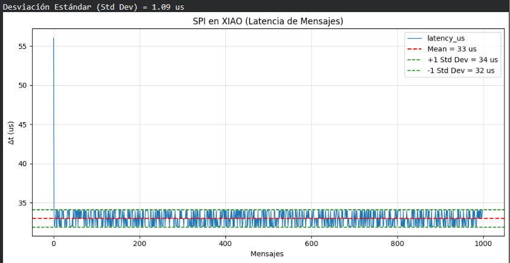

# Práctica 2

En la presente práctica se realizó la evaluación de distintos protocolos de comunicación entre plataformas de sistemas embebidos, con el objetivo de analizar su desempeño en términos de velocidad y latencia. Se implementaron pruebas enviando 1000 mensajes entre dispositivos (ATMEGA328p / Arduino UNO y XIAO ESP32-S3) para registrar y analizar el tiempo de respuesta de cada protocolo.

Los protocolos evaluados fueron:

- **UART**
- **I2C**
- **SPI**

Para cada protocolo se documentan las **conexiones físicas**, los **códigos** y los **resultados** mediante **gráficas de latencia**.

---

# UART

## Conexión

Se realizó la conexión física entre el Arduino UNO y el XIAO ESP32-S3 utilizando comunicación UART. Se compartió una referencia común de tierra (GND) y se conectaron los pines TX y RX correspondientes.

Para proteger al XIAO (3.3 V), se usó un **divisor de voltaje** con resistencias de **1 kΩ** y **460 Ω** para reducir de 5 V a ~3.4 V.

---

## UART Arduino UNO (medición desde Arduino UNO)

### Código (Arduino UNO)

<strong>Código Arduino UNO (UART desde Arduino UNO)</strong>

<pre><code class="language-cpp">
// =====  UART - Arduino UNO - MASTER  =====
#define BAUD_RATE 115200
#define N_MSG     1000

String rxLine = "";

void setup() {
  Serial.begin(BAUD_RATE);   // D0(RX) / D1(TX)
  delay(300);

  // Header CSV
  Serial.println("idx,rtt_us,latency_us");
}

void loop() {
  static bool done = false;
  if (done) return;

  for (int i = 0; i &lt; N_MSG; i++) {
    unsigned long t0 = micros();

    // Enviar PING
    Serial.print("P,");
    Serial.print(i);
    Serial.print("\n");

    // Esperar ACK A,&lt;id&gt;
    rxLine = "";
    while (true) {
      if (Serial.available()) {
        char c = Serial.read();

        if (c == '\n') {
          if (rxLine.startsWith("A,")) {
            int id = rxLine.substring(2).toInt();
            if (id == i) {
              unsigned long t1 = micros();
              unsigned long rtt = t1 - t0;
              unsigned long lat = rtt / 2;

              // CSV
              Serial.print(i);
              Serial.print(",");
              Serial.print(rtt);
              Serial.print(",");
              Serial.println(lat);
              break;
            }
          }
          rxLine = "";
        } else {
          if (rxLine.length() &lt; 40) rxLine += c;
        }
      }
    }
  }

  done = true;
}
</code></pre>

### Código (XIAO ESP32-S3)

<strong>Código XIAO (UART desde Arduino UNO)</strong>

<pre><code class="language-cpp">
// ===== UART - XIAO ESP32-S3 - SLAVE =====
#define UART_RX_PIN D7
#define UART_TX_PIN D6
#define BAUD_RATE   115200

String buf = "";

bool isDigitChar(char c) { return (c &gt;= '0' &amp;&amp; c &lt;= '9'); }

// valida exactamente: digits,digits,digits (para imprimir solo CSV limpio)
bool isCsvRow3(const String &amp;s) {
  if (s.length() &lt; 5) return false; // mínimo "0,0,0"
  if (!isDigitChar(s[0])) return false;

  int commas = 0;
  for (int i = 0; i &lt; (int)s.length(); i++) {
    char c = s[i];
    if (c == ',') commas++;
    else if (!isDigitChar(c)) return false;
  }
  return commas == 2;
}

void setup() {
  Serial.begin(115200);  // USB
  delay(200);

  Serial1.begin(BAUD_RATE, SERIAL_8N1, UART_RX_PIN, UART_TX_PIN);

  Serial.println("XIAO: listo (CSV limpio)");
}

void loop() {
  while (Serial1.available()) {
    char c = Serial1.read();

    if (c == '\n') {
      // quitar CR si llega \r\n
      if (buf.length() &gt; 0 &amp;&amp; buf[buf.length() - 1] == '\r') {
        buf.remove(buf.length() - 1);
      }

      // 1) Responder a P,&lt;id&gt;
      if (buf.startsWith("P,")) {
        int id = buf.substring(2).toInt();
        Serial1.print("A,");
        Serial1.print(id);
        Serial1.print("\n");
      }

      // 2) Imprimir SOLO CSV limpio al USB
      if (buf == "idx,rtt_us,latency_us" || isCsvRow3(buf)) {
        Serial.println(buf);
      }

      buf = "";
    } else {
      if (buf.length() &lt; 140) buf += c;
      else buf = "";
    }
  }
}
</code></pre>

### Resultados

A continuación se presenta la gráfica de latencia del protocolo UART midiendo desde Arduino UNO.

En la gráfica se observa que al inicio la latencia es menor y después se estabiliza cerca de ~1200 µs. Esto puede ocurrir porque al principio los buffers están vacíos y el sistema recién arranca; luego, al entrar en un flujo continuo, el tiempo se vuelve más constante.

---

## UART XIAO ESP32-S3 (medición desde XIAO)

### Código (Arduino UNO)

<strong>Código Arduino UNO (UART desde XIAO ESP32-S3)</strong>

<pre><code class="language-cpp">
// ======== UART - Arduino UNO - SLAVE (eco) ========
const uint32_t BAUD = 115200;

void setup() {
  Serial.begin(BAUD);
}

void loop() {
  if (Serial.available()) {
    int b = Serial.read();
    if (b &gt;= 0) Serial.write((uint8_t)b);
  }
}
</code></pre>

### Código (XIAO ESP32-S3)

<strong>Código XIAO (UART desde XIAO ESP32-S3)</strong>

<pre><code class="language-cpp">
// ======== UART - XIAO ESP32-S3 - MASTER ========
#include &lt;Arduino.h&gt;

const uint32_t BAUD = 115200;
const int TX_PIN = D6;
const int RX_PIN = D7;

const uint16_t N_SAMPLES = 2000;
const uint32_t TIMEOUT_US = 30000;

static inline bool read_one_byte(uint8_t &amp;out, uint32_t timeout_us) {
  uint32_t start = micros();
  while ((uint32_t)(micros() - start) &lt; timeout_us) {
    if (Serial1.available() &gt; 0) {
      int b = Serial1.read();
      if (b &gt;= 0) { out = (uint8_t)b; return true; }
    }
  }
  return false;
}

void setup() {
  Serial.begin(115200);
  while (!Serial) { delay(10); }

  Serial1.begin(BAUD, SERIAL_8N1, RX_PIN, TX_PIN);
  Serial.println("idx,rtt_us,latency_us");
}

void loop() {
  for (uint32_t i = 0; i &lt; N_SAMPLES; i++) {
    while (Serial1.available()) (void)Serial1.read();

    uint8_t tx = (uint8_t)(i &amp; 0xFF);

    uint32_t t0 = micros();
    Serial1.write(tx);

    uint8_t rx = 0;
    bool ok = read_one_byte(rx, TIMEOUT_US);
    uint32_t t1 = micros();

    if (!ok || rx != tx) {
      Serial.print(i);
      Serial.println(",nan,nan");
      continue;
    }

    uint32_t rtt = t1 - t0;
    uint32_t latency = rtt / 2;

    Serial.print(i);
    Serial.print(",");
    Serial.print(rtt);
    Serial.print(",");
    Serial.println(latency);
  }

  while (true) delay(1000);
}
</code></pre>

### Resultados

---

# I2C

## Conexión

Para el armado se hizo una conexión **pull-up a 3.3 V** para evitar daños en el XIAO, con **2 resistencias de 470 Ω**. En I2C las líneas van **directas** (SDA con SDA y SCL con SCL).

---

## I2C (XIAO mide RTT y Arduino reporta latencia interna)

### Código (Arduino UNO)

<strong>Código Arduino UNO (I2C esclavo con latencia)</strong>

<pre><code class="language-cpp">
// ======= I2C - Arduino UNO - SLAVE (con latencia) =======
#include &lt;Wire.h&gt;

#define SLAVE_ADDR 0x08

volatile uint8_t last_token = 0;
volatile uint32_t t_rx = 0;

void onReceive(int n) {
  while (Wire.available()) {
    last_token = Wire.read();
  }
  t_rx = micros();
}

void onRequest() {
  uint32_t latency = micros() - t_rx;

  Wire.write(last_token);
  Wire.write((uint8_t)(latency &amp; 0xFF));
  Wire.write((uint8_t)((latency &gt;&gt; 8) &amp; 0xFF));
  Wire.write((uint8_t)((latency &gt;&gt; 16) &amp; 0xFF));
  Wire.write((uint8_t)((latency &gt;&gt; 24) &amp; 0xFF));
}

void setup() {
  Wire.begin(SLAVE_ADDR);
  Wire.onReceive(onReceive);
  Wire.onRequest(onRequest);

  // Mantener bus a 3.3V: pull-ups internos OFF
  PORTC &amp;= ~((1 &lt;&lt; PC4) | (1 &lt;&lt; PC5));
  pinMode(A4, INPUT);
  pinMode(A5, INPUT);
  digitalWrite(A4, LOW);
  digitalWrite(A5, LOW);
}

void loop() {}
</code></pre>

### Código (XIAO ESP32-S3)

<strong>Código XIAO (I2C maestro - mide)</strong>

<pre><code class="language-cpp">
// ========= I2C - XIAO ESP32-S3 - MASTER =========
#include &lt;Wire.h&gt;

#define SLAVE_ADDR 0x08

const int SDA_PIN = 5;  // D4/SDA = GPIO5
const int SCL_PIN = 6;  // D5/SCL = GPIO6

const uint32_t I2C_HZ = 100000;
const uint32_t N = 2000;
const uint32_t PAUSE_US = 200;

uint32_t readU32LE() {
  uint32_t v = 0;
  v |= (uint32_t)Wire.read();
  v |= (uint32_t)Wire.read() &lt;&lt; 8;
  v |= (uint32_t)Wire.read() &lt;&lt; 16;
  v |= (uint32_t)Wire.read() &lt;&lt; 24;
  return v;
}

void setup() {
  Serial.begin(115200);
  while (!Serial) {}

  Wire.begin(SDA_PIN, SCL_PIN);
  Wire.setClock(I2C_HZ);

  Serial.println("idx,rtt_us,echo_ok,arduino_latency_us");
}

void loop() {
  static uint32_t idx = 0;
  if (idx &gt;= N) while (1) {}

  uint8_t token = (uint8_t)(idx &amp; 0xFF);
  uint32_t t0 = micros();

  Wire.beginTransmission(SLAVE_ADDR);
  Wire.write(token);
  uint8_t err = Wire.endTransmission();

  if (err != 0) {
    uint32_t rtt = micros() - t0;
    Serial.printf("%lu,%lu,%d,%d\n", idx, rtt, 0, -1);
    idx++;
    delayMicroseconds(PAUSE_US);
    return;
  }

  uint8_t got = Wire.requestFrom(SLAVE_ADDR, (uint8_t)5);

  uint8_t echo = 0xFF;
  uint32_t latency = 0xFFFFFFFF;

  if (got == 5) {
    echo = Wire.read();
    latency = readU32LE();
  }

  uint32_t rtt = micros() - t0;
  uint8_t ok = (echo == token) ? 1 : 0;

  Serial.printf("%lu,%lu,%d,%ld\n",
                idx, rtt, ok,
                (latency == 0xFFFFFFFF) ? -1L : (long)latency);

  idx++;
  delayMicroseconds(PAUSE_US);
}
</code></pre>

### Resultados

---

## I2C (medición simple desde XIAO)

### Código (Arduino UNO)

<strong>Código Arduino UNO (I2C esclavo simple)</strong>

<pre><code class="language-cpp">
// ====== I2C - Arduino UNO - SLAVE ======
#include &lt;Wire.h&gt;

#define SLAVE_ADDR 0x08
volatile uint8_t lastByte = 0;

void receiveEvent(int howMany) {
  if (Wire.available()) lastByte = Wire.read();
}

void requestEvent() {
  Wire.write(lastByte);
}

void setup() {
  Wire.begin(SLAVE_ADDR);
  Wire.onReceive(receiveEvent);
  Wire.onRequest(requestEvent);
}

void loop() {}
</code></pre>

### Código (XIAO ESP32-S3)

<strong>Código XIAO (I2C maestro simple)</strong>

<pre><code class="language-cpp">
// =========== I2C - XIAO ESP32-S3 - MASTER ===========
#include &lt;Wire.h&gt;

#define SLAVE_ADDR 0x08
#define MAX_MSGS 1000

uint32_t idx = 0;

void setup() {
  Serial.begin(115200);
  Wire.begin();
  Wire.setClock(400000);
  Serial.println("idx,rtt_us");
}

void loop() {
  if (idx &gt;= MAX_MSGS) while (1) delay(1000);

  uint32_t t0 = micros();

  Wire.beginTransmission(SLAVE_ADDR);
  Wire.write((uint8_t)(idx &amp; 0xFF));
  Wire.endTransmission();

  Wire.requestFrom(SLAVE_ADDR, 1);
  if (Wire.available()) Wire.read();

  uint32_t rtt = micros() - t0;

  Serial.print(idx);
  Serial.print(",");
  Serial.println(rtt);

  idx++;
  delay(5);
}
</code></pre>

### Resultados

---

# SPI

## Conexión

Para el armado se hicieron conexiones directas (pin a pin). Idealmente se recomienda considerar adaptación de nivel de voltaje (UNO 5V vs XIAO 3.3V) para evitar riesgos.

---

## SPI Arduino UNO (Arduino maestro)

### Código (Arduino UNO)

<strong>Código Arduino UNO (SPI desde Arduino)</strong>

<pre><code class="language-cpp">
// ========== SPI - ARDUINO UNO - MAESTRO ==========
#include &lt;SPI.h&gt;

const uint8_t SS_PIN = 10;
const uint8_t CMD    = 0xA5;

const uint16_t MAX_SAMPLES = 1000;
uint16_t idx = 0;

void setup() {
  Serial.begin(115200);

  pinMode(SS_PIN, OUTPUT);
  digitalWrite(SS_PIN, HIGH);

  SPI.begin();
  SPI.setDataMode(SPI_MODE0);
  SPI.setBitOrder(MSBFIRST);

  SPI.setClockDivider(SPI_CLOCK_DIV64); // ~250 kHz

  Serial.println("idx,spi_time_us,rx0,rx1");
}

void loop() {
  if (idx &gt;= MAX_SAMPLES) while (true) {}

  uint32_t t0 = micros();

  digitalWrite(SS_PIN, LOW);
  uint8_t rx0 = SPI.transfer(CMD);
  uint8_t rx1 = SPI.transfer(0x00);
  digitalWrite(SS_PIN, HIGH);

  uint32_t t1 = micros();

  Serial.print(idx);
  Serial.print(",");
  Serial.print(t1 - t0);
  Serial.print(",");
  Serial.print(rx0);
  Serial.print(",");
  Serial.println(rx1);

  idx++;
  delay(5);
}
</code></pre>

### Código (XIAO ESP32-S3)

<strong>Código XIAO (SPI desde Arduino)</strong>

<pre><code class="language-cpp">
// =========== SPI - XIAO ESP32-S3 - SLAVE ===========
#include &lt;Arduino.h&gt;
extern "C" {
  #include "driver/spi_slave.h"
  #include "driver/gpio.h"
}

static const int PIN_SS   = 7;
static const int PIN_SCK  = 8;
static const int PIN_MOSI = 10;
static const int PIN_MISO = 9;

static const uint8_t CMD = 0xA5;

static uint8_t tx_buf[2];
static uint8_t rx_buf[2];
static uint8_t counter = 0;

void setup() {
  spi_bus_config_t buscfg = {};
  buscfg.mosi_io_num = PIN_MOSI;
  buscfg.miso_io_num = PIN_MISO;
  buscfg.sclk_io_num = PIN_SCK;
  buscfg.quadwp_io_num = -1;
  buscfg.quadhd_io_num = -1;

  spi_slave_interface_config_t slvcfg = {};
  slvcfg.spics_io_num = PIN_SS;
  slvcfg.flags = 0;
  slvcfg.queue_size = 1;
  slvcfg.mode = 0;

  esp_err_t ret = spi_slave_initialize(SPI2_HOST, &amp;buscfg, &amp;slvcfg, SPI_DMA_CH_AUTO);
  if (ret != ESP_OK) while (true) delay(1000);

  tx_buf[0] = 0; tx_buf[1] = 0;
  rx_buf[0] = 0; rx_buf[1] = 0;
}

void loop() {
  tx_buf[0] = counter;
  tx_buf[1] = 0;

  spi_slave_transaction_t t = {};
  t.length = 2 * 8;
  t.tx_buffer = tx_buf;
  t.rx_buffer = rx_buf;

  esp_err_t ret = spi_slave_transmit(SPI2_HOST, &amp;t, portMAX_DELAY);
  if (ret == ESP_OK) {
    if (rx_buf[0] == CMD) counter++;
  }
}
</code></pre>

### Resultados

---

## SPI XIAO ESP32-S3 (XIAO maestro)

### Código (Arduino UNO)

<strong>Código Arduino UNO (SPI esclavo)</strong>

<pre><code class="language-cpp">
// ========== SPI - ARDUINO UNO - SLAVE ==========
#include &lt;SPI.h&gt;

volatile uint8_t replyByte = 0;
volatile uint8_t lastReceived = 0;

ISR(SPI_STC_vect) {
  lastReceived = SPDR;
  SPDR = replyByte;
  if (lastReceived == 0xA5) replyByte++;
}

void setup() {
  pinMode(MISO, OUTPUT);
  pinMode(SS, INPUT_PULLUP);
  SPCR |= _BV(SPE);
  SPCR |= _BV(SPIE);
  SPDR = replyByte;
}

void loop() {}
</code></pre>

### Código (XIAO ESP32-S3)

<strong>Código XIAO (SPI maestro)</strong>

<pre><code class="language-cpp">
// ========= SPI - XIAO ESP32-S3 - MASTER =========
#include &lt;SPI.h&gt;

static const int PIN_SS   = 7;
static const int PIN_SCK  = 8;
static const int PIN_MISO = 9;
static const int PIN_MOSI = 10;

static const uint8_t CMD = 0xA5;
static const uint16_t MAX_SAMPLES = 1000;

void setup() {
  Serial.begin(115200);
  while (!Serial) {}

  pinMode(PIN_SS, OUTPUT);
  digitalWrite(PIN_SS, HIGH);

  SPI.begin(PIN_SCK, PIN_MISO, PIN_MOSI, PIN_SS);
  Serial.println("idx,rtt_us,rx");
}

void loop() {
  static uint16_t idx = 0;
  if (idx &gt;= MAX_SAMPLES) while (true) {}

  SPI.beginTransaction(SPISettings(1000000, MSBFIRST, SPI_MODE0));

  uint32_t t0 = micros();

  digitalWrite(PIN_SS, LOW);
  SPI.transfer(CMD);
  SPI.transfer(0x00);
  uint8_t rx = SPI.transfer(0x00);
  digitalWrite(PIN_SS, HIGH);

  uint32_t t1 = micros();
  SPI.endTransaction();

  Serial.print(idx++);
  Serial.print(",");
  Serial.print(t1 - t0);
  Serial.print(",");
  Serial.println(rx);
}
</code></pre>

### Resultados

---

## Siguiente sección

[Calibración](calibracion.md)
