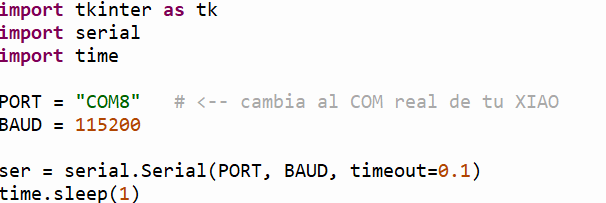
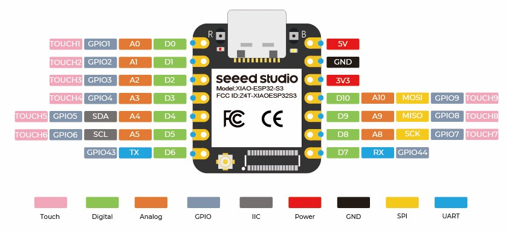
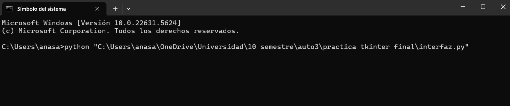
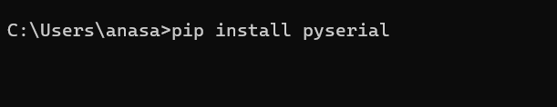

# Tkinter comunicado con ESP32

  En la presente práctica se realizó la comunicación serial entre una computadora personal y una placa XIAO ESP32S3 utilizando MicroPython y una interfaz gráfica desarrollada en Python con Tkinter. El objetivo principal fue establecer un sistema de interacción bidireccional que permitiera tanto la lectura de un botón físico conectado a la placa como el control de un actuador (LED) desde una interfaz gráfica en la computadora.

---

## Codigo generado en Thonny con Tkinter para interfaz gráfica

- **Código**  

  <a 
    href="{{ '/assets/files/interfaz.py' | relative_url }}" 
    download="interfaz.py"
    style="
      display:inline-block;
      padding:12px 18px;
      background: linear-gradient(135deg, #484D8A, #5E63A8);
      color:white;
      border-radius:12px;
      text-decoration:none;
      font-weight:600;
      font-size:0.95rem;
      box-shadow: 0 6px 14px rgba(72,77,138,0.25);
      transition: all 0.2s ease;
    "
    onmouseover="this.style.transform='translateY(-2px)'; this.style.boxShadow='0 8px 18px rgba(72,77,138,0.35)';"
    onmouseout="this.style.transform='translateY(0)'; this.style.boxShadow='0 6px 14px rgba(72,77,138,0.25)';"
  >
    ⬇ Descargar archivo interfaz.py
  </a>

El código presentado implementa una interfaz gráfica desarrollada en Python utilizando la biblioteca Tkinter, cuya función principal es establecer comunicación serial con una placa XIAO ESP32S3 para el monitoreo y control de entradas y salidas digitales.

Inicialmente, se importan las bibliotecas necesarias: tkinter para la creación de la interfaz gráfica, serial para la comunicación a través del puerto USB y time para introducir retardos que aseguren la correcta inicialización del puerto serial. Posteriormente, se configura el puerto de comunicación (COM8) y la velocidad de transmisión de datos a 115200 baudios, estableciendo la conexión serial con la placa.

Una vez inicializada la comunicación, se crea la ventana principal de la interfaz gráfica, en la cual se incorporan elementos visuales como un canvas que contiene un círculo, el cual funciona como indicador del estado del botón físico conectado a la placa. Dicho círculo cambia de color de rojo a verde dependiendo de los mensajes recibidos por el puerto serial (OFF u ON).

Adicionalmente, se incluye una etiqueta de texto que muestra el estado del LED conectado al pin D3, permitiendo al usuario conocer si este se encuentra encendido o apagado. Para el control del LED, se implementa un botón en la interfaz gráfica que, al ser presionado, envía un comando serial a la placa para alternar el estado del LED.

---

## Codigo generado en Thonny para la programación del ESP32

  - **Código** 

    

        <a 
            href="{{ '/assets/files/codigoesp32.py' | relative_url }}" 
            download="interfaz.py"
            style="
            display:inline-block;
            padding:12px 18px;
            background: linear-gradient(135deg, #484D8A, #5E63A8);
            color:white;
            border-radius:12px;
            text-decoration:none;
            font-weight:600;
            font-size:0.95rem;
            box-shadow: 0 6px 14px rgba(72,77,138,0.25);
            transition: all 0.2s ease;
            "
            onmouseover="this.style.transform='translateY(-2px)'; this.style.boxShadow='0 8px 18px rgba(72,77,138,0.35)';"
            onmouseout="this.style.transform='translateY(0)'; this.style.boxShadow='0 6px 14px rgba(72,77,138,0.25)';"
        >
            ⬇ Descargar archivo codigoesp32.py
        </a>
    

    El código implementa el control y monitoreo de una XIAO ESP32S3 utilizando MicroPython, permitiendo la interacción simultánea con un botón físico y un LED mediante comunicación serial con una computadora.

    En primer lugar, se configuran los pines de entrada y salida digital: un botón físico conectado al pin D4, el cual utiliza una resistencia pull-up interna para la correcta detección de pulsaciones, y un LED conectado al pin D3, cuyo estado es controlado desde una interfaz gráfica en la computadora. Para la gestión de estos elementos se emplean variables de estado que permiten identificar cambios en el botón y en el LED.

    

    Durante el ciclo principal del programa, el estado del botón físico es evaluado constantemente y, al detectarse una pulsación, se envían mensajes ON u OFF a través del puerto serial para su visualización en la interfaz gráfica. Al mismo tiempo, el microcontrolador recibe y procesa comandos enviados desde la computadora, los cuales permiten encender, apagar o alternar el estado del LED conectado al pin D3.

---

## Ejecución del programa en CMD y dependencias necesarias

  - **Ejecución del programa** 
    
    Para ejecutar la interfaz gráfica desarrollada en Python desde el Símbolo del sistema (CMD), es necesario indicar correctamente la ubicación del archivo .py. Cuando el archivo se encuentra en una carpeta con espacios o dentro de directorios específicos (por ejemplo, en OneDrive), se recomienda utilizar la ruta completa (ruta absoluta) entre comillas para evitar errores de lectura en la terminal. Esto permite que el comando identifique sin ambigüedades el archivo a ejecutar.

    

    Adicionalmente, para que el programa funcione correctamente es indispensable contar con las librerías necesarias instaladas en el entorno de Python. En particular, debido a que la interfaz se comunica con la XIAO ESP32S3 mediante puerto serial, se requiere instalar el módulo pyserial, ya que este permite abrir el puerto COM y leer/escribir datos desde Python. La instalación se realiza desde CMD mediante:

      pip install pyserial

    

    Una vez instalada la librería, el programa puede ejecutarse y visualizarse.
---

## Video funcional

- **Video funcionando**  
    <video controls width="640">
      <source src="{{ '/assets/img/p3_video.mp4' | relative_url }}" type="video/mp4">
      Tu navegador no soporta video HTML5.
    </video>

---
## Siguiente sección

[Primer archivo G-code (.nc)](primer-gcode.md)
