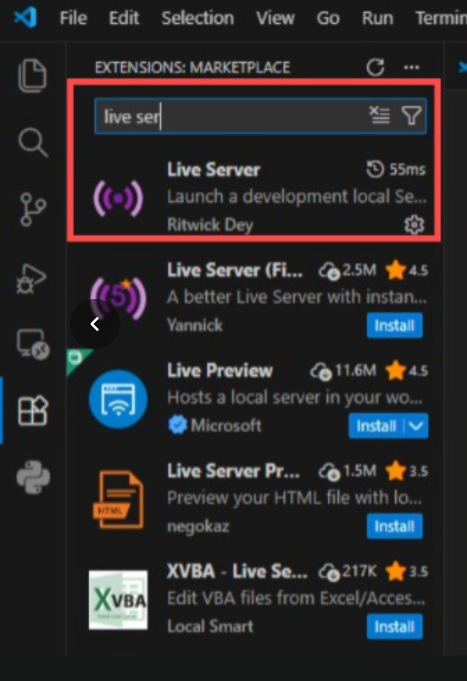
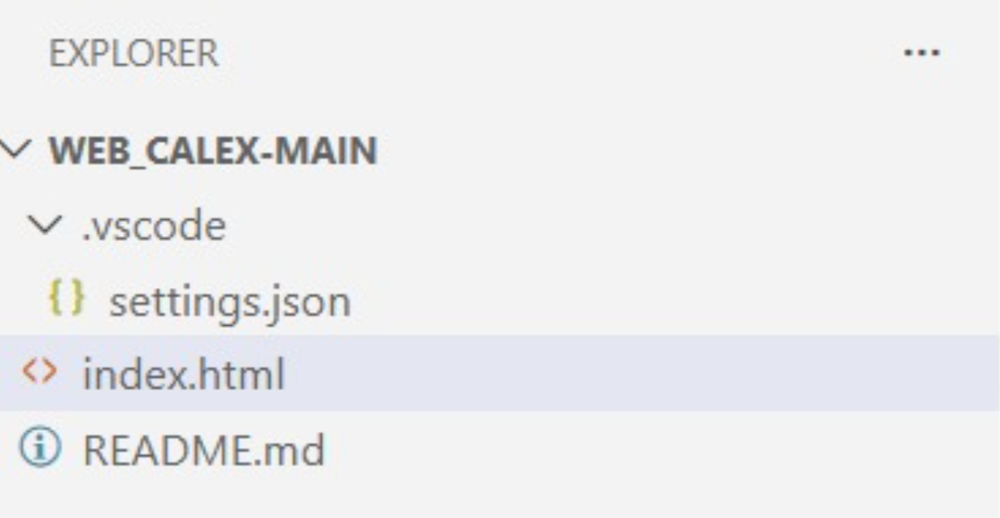
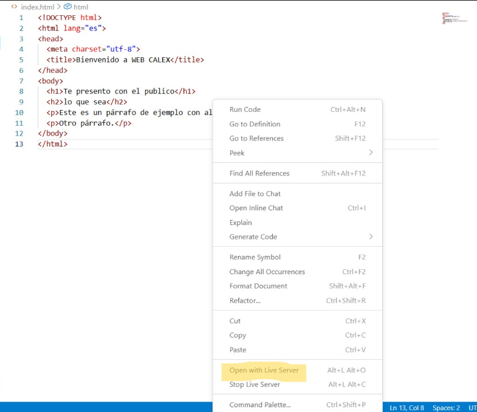
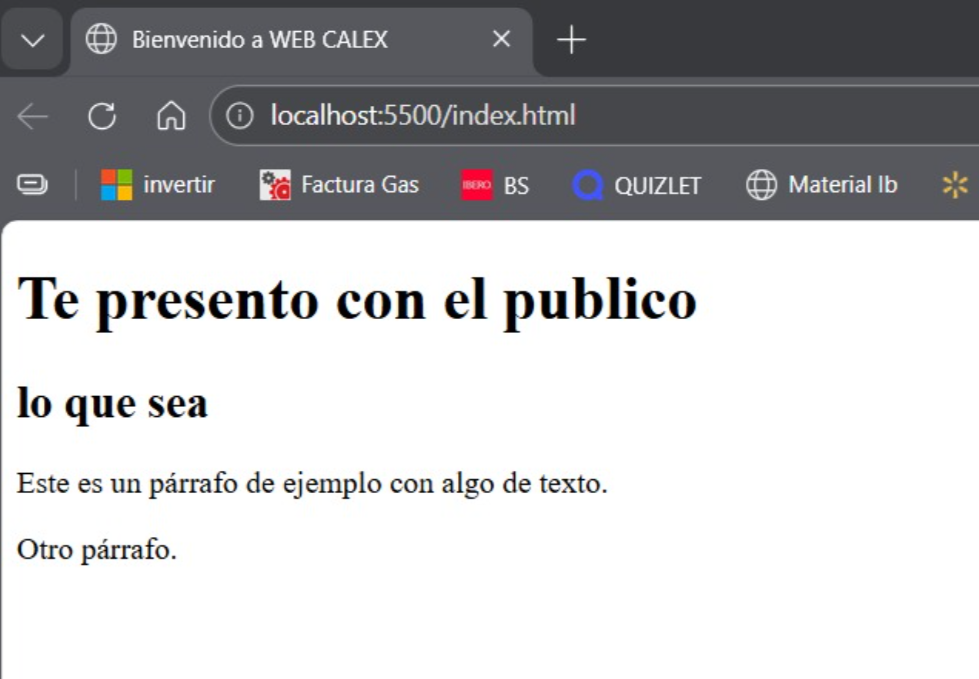

# Página web local con Live Server

## Objetivo

Crear y visualizar una página web local básica en Visual Studio Code utilizando la extensión Live Server, configurando un puerto local y comprobando su funcionamiento desde el navegador.

---

## Material / Herramientas utilizadas

- **Visual Studio Code**
- Extensión **Live Server**
- Archivo **index.html**
- Archivo de configuración **settings.json** (dentro de *vscode*)

---

## Procedimiento

### 1. Instalación de la extensión Live Server en VS Code

Primero se descargó e instaló la extensión **Live Server** en Visual Studio Code desde la sección de extensiones.



---

### 2. Estructura de la carpeta del proyecto

Se creó una carpeta de trabajo llamada **WEB_CALEX-MAIN**, en la cual se observan los archivos principales del proyecto:
- `index.html`
- `README.md`
- carpeta en vscode con `settings.json`



### 3. Creación del archivo index.html

Después se creó el archivo **index.html**, donde se escribió la estructura básica de una página HTML con:

#### Código usado en `index.html`

```html
<!DOCTYPE html>
<html lang="es">
<head>
    <meta charset="utf-8">
    <title>Bienvenido a WEB CALEX</title>
</head>
<body>
    <h1>Te presento con el publico</h1>
    <h2>lo que sea</h2>
    <p>Este es un párrafo de ejemplo con algo de texto.</p>
    <p>Otro párrafo.</p>
</body>
</html>
 
```

### 4. Configuración de Live Server en settings.json

Posteriormente, dentro de la carpeta **vscode**, se configuró el archivo **settings.json** para definir el puerto y el host que utilizaría Live Server al ejecutar la página web local.

En este caso:
- se asignó el **puerto 5500**
- y el **host localhost**

#### Código usado en settings.json

```json
{
  "liveServer.settings.port": 5500,
  "liveServer.settings.host": "localhost"
}
``` 

### 5. Apertura del archivo con Live Server

Una vez creados y configurados los archivos del proyecto, se procedió a abrir la página web local desde Visual Studio Code.

Para ello, se dio clic derecho sobre el archivo **index.html** y se seleccionó la opción **Open with Live Server**.  
Esta acción ejecuta automáticamente un servidor local y abre la página en el navegador predeterminado.

#### Captura sugerida: opción **Open with Live Server** en VS Code


---

### 6. Visualización de la página web local

Después de ejecutar Live Server, la página web se abrió correctamente en el navegador mediante la dirección local proporcionada por el servidor.

La página puede visualizarse usando una dirección como:
- `http://localhost:5500/index.html`

En algunos casos, también puede abrirse mediante la **IP local del equipo** (por ejemplo, dentro de la misma red), usando el mismo puerto configurado por Live Server.

#### Captura sugerida: página web abierta en el navegador con Live Server


---

### 7. Resultado final

Con este procedimiento se logró abrir y visualizar correctamente una **página web local** utilizando **Live Server** en Visual Studio Code, comprobando el funcionamiento del archivo index.html desde el navegador.

---
## Siguiente sección

[API local con Flask - Guardar y leer datos](practica5.md)
