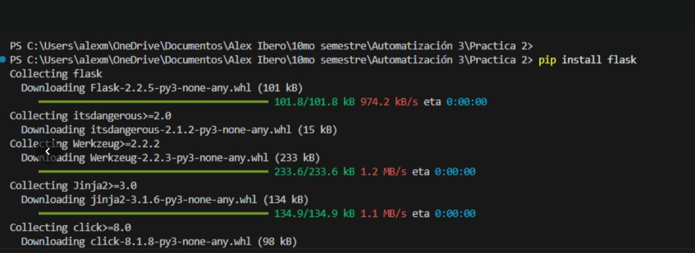
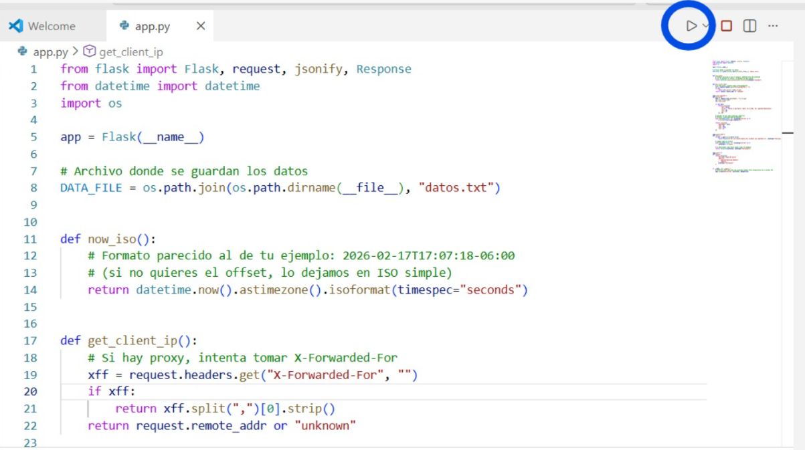
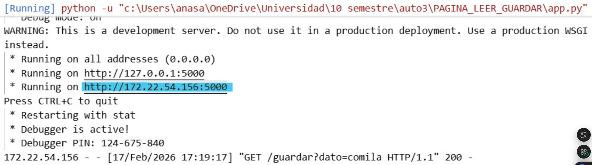

# API local con Flask - Guardar y leer datos

## Objetivo

Crear una API local básica con **Flask** que permita:
- **guardar** un dato mediante una URL, y
- **leer** los datos almacenados

todo esto ejecutando un archivo `app.py` en Visual Studio Code y accediendo desde el navegador.

---

## Material / Herramientas utilizadas

- **Visual Studio Code**
- **Python**
- Librería **Flask**
- Archivo **app.py**
- Terminal de VS Code / PowerShell y Navegador web

---

## Procedimiento

### 1. Instalación de Flask

Primero se instaló la librería **Flask** desde la terminal con el comando:

```bash
pip install flask

```


---
### 2. Preparación del archivo app.py

Después de instalar Flask, se tuvo listo el archivo **app.py**, que contiene el programa en Python encargado de crear la API local.

Este archivo incluye la lógica para:
- iniciar el servidor Flask,
- definir las rutas para **guardar** datos (/guardar),
- y definir la ruta para **leer** los datos almacenados (/leer).

Una vez verificado el código, el archivo quedó listo para ejecutarse desde Visual Studio Code.

#### Captura del código del archivo app.py


- **Código**  

<div style="margin: 1.5rem 0;">

  <a 
    href="{{ '/assets/files/app.py' | relative_url }}" 
    download="interfaz.py"
    style="
      display:inline-block;
      padding:12px 18px;
      background: linear-gradient(135deg, #484D8A, #5E63A8);
      color:white;
      border-radius:12px;
      text-decoration:none;
      font-weight:600;
      font-size:0.95rem;
      box-shadow: 0 6px 14px rgba(72,77,138,0.25);
      transition: all 0.2s ease;
    "
    onmouseover="this.style.transform='translateY(-2px)'; this.style.boxShadow='0 8px 18px rgba(72,77,138,0.35)';"
    onmouseout="this.style.transform='translateY(0)'; this.style.boxShadow='0 6px 14px rgba(72,77,138,0.25)';"
  >
    ⬇ Descargar archivo app.py
  </a>

</div>

--- 
### 3. Ejecución del programa y visualización de la IP en terminal

Una vez preparado el archivo `app.py`, se ejecutó el programa desde Visual Studio Code.

Al iniciar el servidor Flask, en la terminal se mostraron las direcciones disponibles para acceder a la API local, incluyendo:
- la dirección local (`127.22.54.156`)
- y la **IP de red local** del equipo (con el puerto `5000`)

Esta IP es la que se puede usar en el navegador para probar las rutas de la API, por ejemplo desde el mismo equipo o desde otro dispositivo conectado a la misma red.

#### Captura terminal con IP del servidor Flask

---

### 4. Prueba de las rutas para guardar y leer datos (`/guardar` y `/leer`)

Con el servidor Flask en ejecución, se realizaron pruebas desde el navegador utilizando las rutas de la API para **guardar** y **leer** datos.

#### a) Ruta para guardar datos (`/guardar`)

Primero se probó la ruta `/guardar`, enviando un valor mediante el parámetro `dato`.

Liga utilizada:
- `http://172.22.54.156:5000/guardar?dato=perro`

Al abrir esta dirección, el servidor recibe el valor enviado (`perro`) y lo almacena para su posterior consulta.

---

#### b) Ruta para leer datos (`/leer`)

Después, se probó la ruta `/leer` para consultar los datos almacenados por el servidor.

Liga utilizada:
- `http://172.22.54.156:5000/leer`

Esta ruta devuelve la información guardada previamente, permitiendo verificar que el servidor Flask está funcionando correctamente.


 **Nota:** La IP puede cambiar dependiendo de la red en la que se conecte el equipo.  
 Si cambia, solo se reemplaza la IP y se conserva el puerto `5000`.

---
## Resultado

Se logró ejecutar correctamente una API local con Flask y probar sus rutas desde el navegador.  
Fue posible **guardar** un dato con la ruta `/guardar` y **consultarlo** después con la ruta `/leer`.

---

## Conclusión

Esta práctica permitió aprender el proceso básico para crear y ejecutar un servidor local con Flask, así como probar rutas HTTP para guardar y leer datos.  
También ayudó a identificar la IP del equipo y usarla para acceder al servicio desde el navegador.

---
## Siguiente sección
[Aplicación Web ESP-32](practica6_.md)
