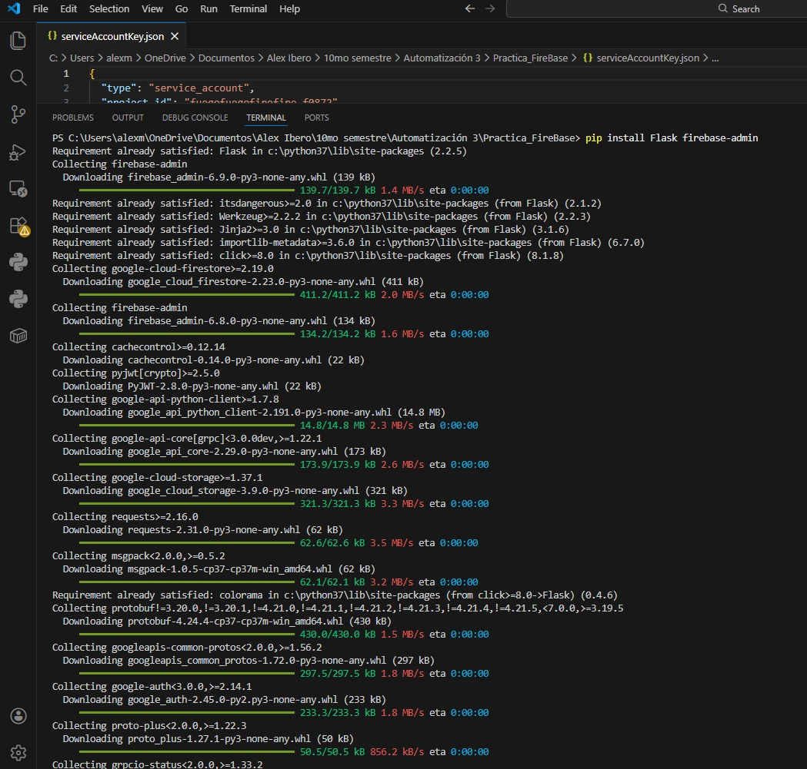
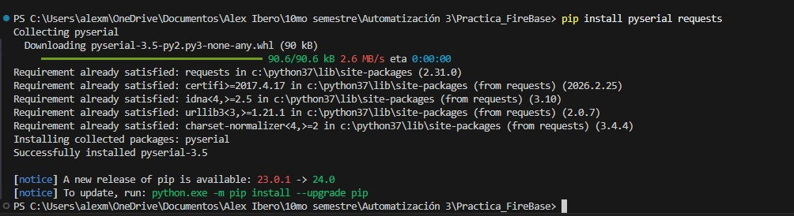
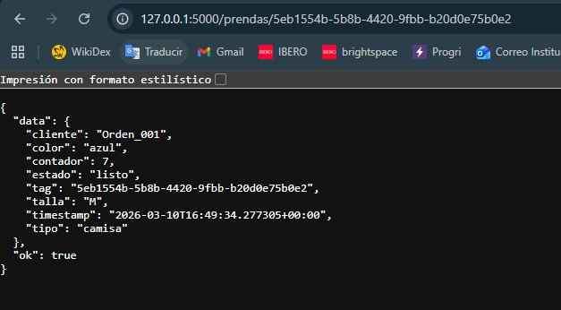
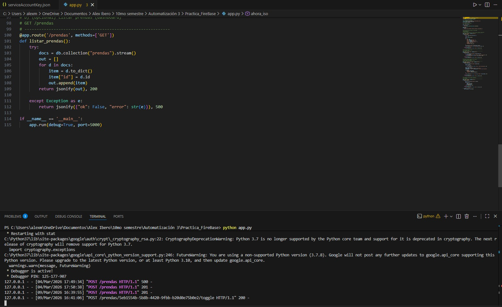
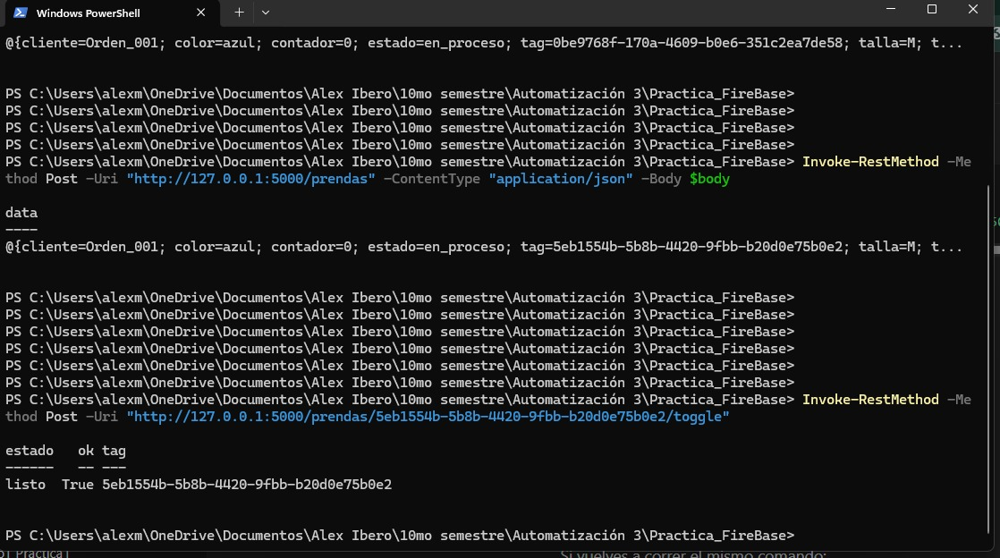
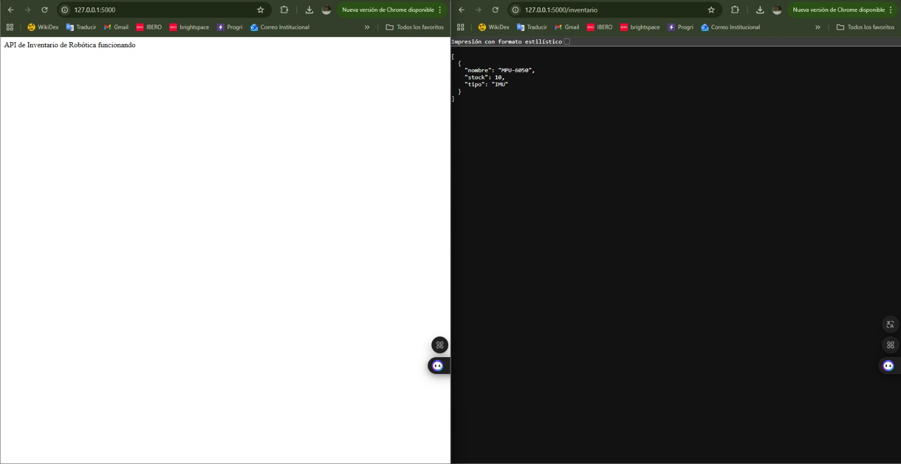
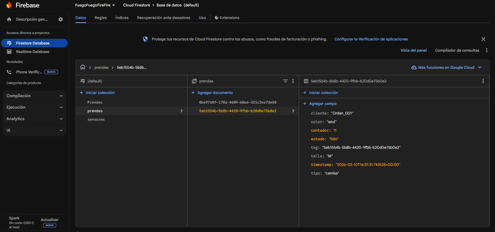
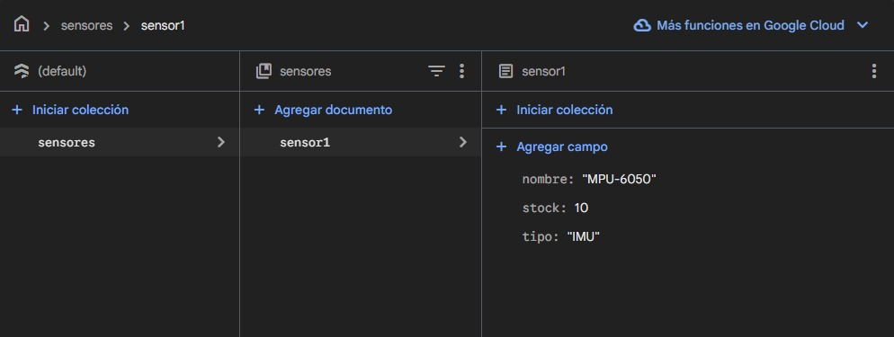
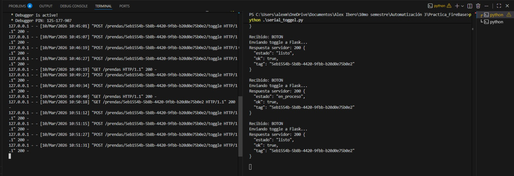
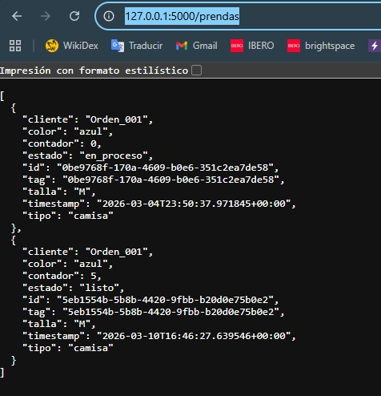

# Base de datos en la nube con Firebase y Flask

## Objetivo

Desarrollar una API local con Flask conectada a Firebase Firestore para registrar, consultar y actualizar información de prendas. Además, integrar una XIAO ESP32S3 con un botón físico para cambiar el estado de una prenda mediante comunicación serial y reflejar esos cambios en la base de datos en la nube.

---

## Material / Herramientas utilizadas

- XIAO ESP32S3
- Botón
- Cable USB
- Computadora
- Visual Studio Code
- Python
- Flask
- Firebase Admin SDK
- pyserial
- requests
- Firebase Console
- Firestore Database

---

## Procedimiento

### 1. Configuración del proyecto en Firebase

Primero se ingresó a la consola de Firebase para configurar el proyecto que se utilizaría durante la práctica. Dentro de esta plataforma se habilitó Firestore Database, que funcionó como base de datos en la nube para almacenar la información de las prendas y otros elementos de prueba.

Posteriormente, en la sección de cuentas de servicio, se generó una clave privada para permitir la autenticación desde Python mediante Firebase Admin SDK.


---

### 2. Instalación de librerías necesarias en Python

Una vez configurado el proyecto, se instalaron las librerías necesarias para desarrollar la API local y la conexión con Firebase. En esta parte se utilizaron Flask y firebase-admin como base principal del proyecto.



Después, se instalaron también las librerías pyserial y requests, necesarias para la comunicación serial con la XIAO ESP32S3 y para el envío de peticiones HTTP desde el script auxiliar hacia la API desarrollada en Flask.



---

### 3. Archivo de credenciales del proyecto

Después de generar la clave privada, se descargó el archivo `serviceAccountKey.json` y se colocó dentro de la carpeta del proyecto. Este archivo permitió autenticar la aplicación desarrollada en Python con la base de datos de Firebase.



---

### 4. Desarrollo del archivo `app.py`

Una vez instaladas las librerías y configuradas las credenciales, se desarrolló el archivo `app.py`, el cual funcionó como la API principal del proyecto. Este programa permitió conectar Flask con Firebase Firestore para crear, consultar, actualizar y listar prendas registradas en la base de datos.

En esta API se implementaron las siguientes rutas principales:

- `/` para comprobar que el servidor estuviera funcionando
- `/prendas` con método `POST` para crear una nueva prenda
- `/prendas/<tag>` con método `GET` para consultar una prenda específica
- `/prendas/<tag>/toggle` con método `POST` para alternar su estado y aumentar el contador
- `/prendas` con método `GET` para listar todas las prendas registradas



#### Código usado en `app.py`

```python
import firebase_admin
from firebase_admin import credentials, firestore
from flask import Flask, jsonify, request
from datetime import datetime, timezone

# 1. Configuración de Firebase
cred = credentials.Certificate("serviceAccountKey.json")
firebase_admin.initialize_app(cred)
db = firestore.client()

# 2. Configuración de Flask
app = Flask(__name__)

def ahora_iso():
    return datetime.now(timezone.utc).isoformat()

@app.route('/')
def home():
    return "API de Prendas (Proyecto Terminal) funcionando 👕"

# ------------------------------------------------------------
# A) Crear una prenda y generar un TAG (UUID)
# POST /prendas
# Body JSON ejemplo:
# {"tipo":"camisa","talla":"M","color":"azul","cliente":"Orden_001"}
# ------------------------------------------------------------
@app.route('/prendas', methods=['POST'])
def crear_prenda():
    try:
        data = request.get_json(force=True)

        import uuid
        tag = str(uuid.uuid4())

        doc = {
            "tag": tag,
            "tipo": data.get("tipo", ""),
            "talla": data.get("talla", ""),
            "color": data.get("color", ""),
            "cliente": data.get("cliente", ""),
            "estado": "en_proceso",
            "contador": 0,
            "timestamp": ahora_iso()
        }

        db.collection("prendas").document(tag).set(doc)
        return jsonify({"ok": True, "tag": tag, "data": doc}), 201

    except Exception as e:
        return jsonify({"ok": False, "error": str(e)}), 500

# ------------------------------------------------------------
# B) Consultar prenda por TAG
# GET /prendas/<tag>
# ------------------------------------------------------------
@app.route('/prendas/<tag>', methods=['GET'])
def get_prenda(tag):
    try:
        ref = db.collection("prendas").document(tag).get()
        if not ref.exists:
            return jsonify({"ok": False, "error": "TAG no encontrado"}), 404
        return jsonify({"ok": True, "data": ref.to_dict()}), 200

    except Exception as e:
        return jsonify({"ok": False, "error": str(e)}), 500

# ------------------------------------------------------------
# C) BOTÓN: alternar estado y sumar contador
# POST /prendas/<tag>/toggle
# Cambia estado: en_proceso <-> listo
# ------------------------------------------------------------
@app.route('/prendas/<tag>/toggle', methods=['POST'])
def toggle_estado(tag):
    try:
        ref = db.collection("prendas").document(tag)
        snap = ref.get()

        if not snap.exists:
            return jsonify({"ok": False, "error": "TAG no encontrado"}), 404

        data = snap.to_dict()
        estado_actual = data.get("estado", "en_proceso")
        nuevo_estado = "listo" if estado_actual != "listo" else "en_proceso"

        ref.update({
            "estado": nuevo_estado,
            "timestamp": ahora_iso(),
            "contador": firestore.Increment(1)
        })

        return jsonify({"ok": True, "tag": tag, "estado": nuevo_estado}), 200

    except Exception as e:
        return jsonify({"ok": False, "error": str(e)}), 500

# ------------------------------------------------------------
# D) (Opcional) Listar prendas (dashboard)
# GET /prendas
# ------------------------------------------------------------
@app.route('/prendas', methods=['GET'])
def listar_prendas():
    try:
        docs = db.collection("prendas").stream()
        out = []
        for d in docs:
            item = d.to_dict()
            item["id"] = d.id
            out.append(item)
        return jsonify(out), 200

    except Exception as e:
        return jsonify({"ok": False, "error": str(e)}), 500

if __name__ == '__main__':
    app.run(debug=True, port=5000)
```

---

### 5. Ejecución y verificación inicial de la API

Después de escribir el archivo `app.py`, se ejecutó el programa desde la terminal de Visual Studio Code con el comando correspondiente de Python. Al iniciar correctamente, Flask quedó disponible en el puerto 5000 del equipo local.

En esta etapa se verificó que la API estuviera activa accediendo desde el navegador a la ruta principal. También se probó una ruta adicional para comprobar la consulta de información almacenada en la base de datos.



Con esta prueba se confirmó que la aplicación Flask estaba funcionando y que ya existía comunicación entre el programa local y Firebase.

---

### 6. Pruebas manuales de la API desde PowerShell

Una vez verificado que Flask estaba funcionando correctamente, se realizaron pruebas manuales desde PowerShell para comprobar el comportamiento de las rutas implementadas. Estas pruebas permitieron crear una prenda en la base de datos y posteriormente ejecutar el cambio de estado mediante una petición al endpoint correspondiente.

Primero se envió una petición `POST` a la ruta `/prendas`, incluyendo un cuerpo en formato JSON con los datos de una prenda. Después, se utilizó la ruta `/prendas/<tag>/toggle` para alternar el estado del registro creado.



Estas pruebas fueron importantes porque permitieron validar la lógica del sistema antes de integrar el botón físico y la comunicación serial.

---

### 7. Verificación de datos almacenados en Firebase

Después de realizar las pruebas manuales, se ingresó a Firestore Database dentro de Firebase para comprobar que los datos realmente se estaban guardando en la nube. En esta parte se observó tanto una colección de prueba de sensores como la colección principal de prendas utilizada en el proyecto.

Primero se verificó una colección básica de inventario o sensores, con el fin de confirmar que la conexión entre Python y Firestore funcionaba correctamente.



Posteriormente, se revisó la colección `prendas`, en donde ya aparecían los documentos generados desde la API. En estos registros se observó información como el cliente, color, contador, estado, talla, timestamp y tipo de prenda.



Con esta comprobación se confirmó que la API desarrollada en Flask sí estaba escribiendo información correctamente en la base de datos de Firebase.

---

### 8. Consulta de registros mediante endpoints GET

Una vez almacenados los datos, se probaron también las rutas de consulta para visualizar la información directamente desde el navegador. La primera prueba consistió en listar todas las prendas registradas en la base de datos mediante la ruta `/prendas`.



Después, se utilizó la ruta `/prendas/<tag>` para consultar una prenda específica a partir de su identificador único. Esta ruta devolvió en formato JSON los datos completos del registro seleccionado.



Estas pruebas permitieron confirmar que la API no solo guardaba información, sino que también podía recuperarla correctamente desde la base de datos.

---

### 9. Integración de la XIAO ESP32S3 con botón físico

Después de comprobar que la API funcionaba correctamente, se integró una tarjeta XIAO ESP32S3 con un botón conectado al pin D3, correspondiente al GPIO4. El objetivo de esta parte fue detectar una pulsación física y enviar un mensaje por el puerto serial cada vez que el botón fuera presionado.

El programa cargado en la tarjeta fue el siguiente:

#### Código usado en la XIAO ESP32S3

```cpp
const int BUTTON_PIN = 4;   // D3 = GPIO4

bool lastState = HIGH;

void setup() {
  Serial.begin(115200);
  pinMode(BUTTON_PIN, INPUT_PULLUP);
}

void loop() {
  bool currentState = digitalRead(BUTTON_PIN);

  // Detecta cuando presionas el botón
  if (lastState == HIGH && currentState == LOW) {
    Serial.println("BOTON");
    delay(300);   // anti-rebote simple
  }

  lastState = currentState;
}
```

Con este código, la tarjeta enviaba la palabra `BOTON` cada vez que detectaba una transición de no presionado a presionado.

---

### 10. Desarrollo del archivo `serial_toggle.py`

Para enlazar la señal enviada por la XIAO con la API desarrollada en Flask, se utilizó un segundo script en Python llamado `serial_toggle.py`. Este programa se encargó de escuchar el puerto serial y, al recibir la palabra `BOTON`, ejecutar una petición `POST` al endpoint `/prendas/<tag>/toggle`.

#### Código usado en `serial_toggle.py`

```python
import serial
import requests

# COM POR DE LA XIAO
SERIAL_PORT = "COM16"
BAUD_RATE = 115200

# TU TAG DE LA PRENDA
TAG = "5eb1554b-5b8b-4420-9fbb-b20d0e75b0e2"

# URL de tu API Flask
URL = f"http://127.0.0.1:5000/prendas/{TAG}/toggle"

print("Conectando al puerto serial...")
ser = serial.Serial(SERIAL_PORT, BAUD_RATE, timeout=1)

print("Escuchando botón...")

while True:
    line = ser.readline().decode(errors="ignore").strip()

    if line:
        print("Recibido:", line)

    if line == "BOTON":
        print("Enviando toggle a Flask...")
        try:
            r = requests.post(URL)
            print("Respuesta servidor:", r.status_code, r.text)
        except Exception as e:
            print("Error:", e)
```

Este script permitió conectar el evento físico del botón con la lógica de actualización del estado de una prenda registrada en Firebase.

---

### 11. Ejecución conjunta del sistema

Una vez preparados todos los elementos, se ejecutó el sistema completo en dos terminales: una para correr `app.py` y otra para correr `serial_toggle.py`. Al presionar el botón conectado a la XIAO, la tarjeta enviaba el mensaje por serial, el script lo detectaba y Flask actualizaba el estado de la prenda correspondiente en Firebase.

En la terminal se pudo observar tanto la recepción del mensaje desde la XIAO como la respuesta del servidor Flask al realizar el cambio de estado.

Con esta integración se logró una comunicación completa entre hardware, software local y base de datos en la nube.

---

### 12. Resultado final

Como resultado de la práctica, se desarrolló un sistema funcional capaz de registrar y consultar prendas en Firebase mediante una API creada con Flask, así como actualizar el estado de una prenda a partir de la pulsación de un botón físico conectado a una XIAO ESP32S3.

Además de las capturas del procedimiento, se obtuvo un video donde se muestra el funcionamiento general del sistema durante la práctica.

#### Video del funcionamiento

<video controls width="700">
  <source src="/workspaces/Projects_page/assets/img/practica6/video_pruebaBDFirebases.mp4" type="video/mp4">
  Tu navegador no soporta la reproducción de video.
</video>

---

## Conclusión

En esta práctica se logró integrar una base de datos en la nube con una API local y un sistema embebido. A través de Firebase Firestore y Flask fue posible crear, consultar y actualizar registros en tiempo real, mientras que la XIAO ESP32S3 permitió incorporar una entrada física al sistema mediante un botón. Esta práctica ayudó a comprender cómo enlazar hardware, software y servicios en la nube dentro de una misma solución funcional.

---

## Siguiente sección

[Volver al inicio](index.md)