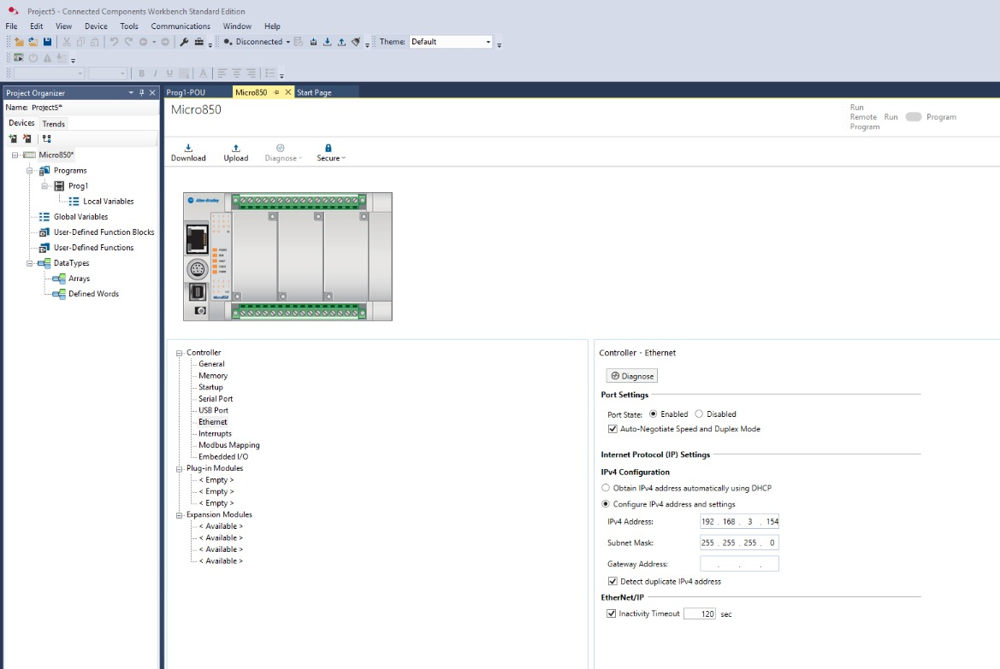
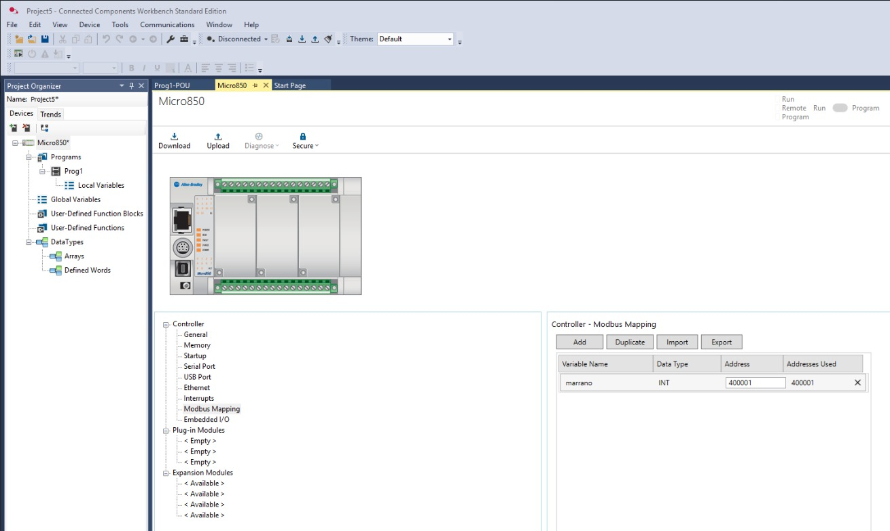
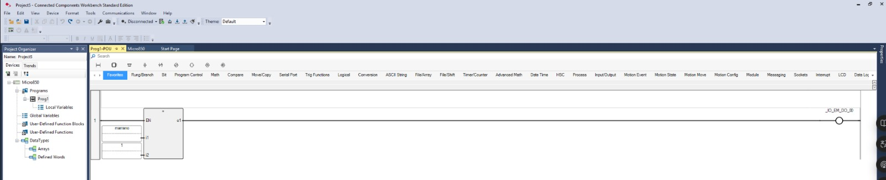
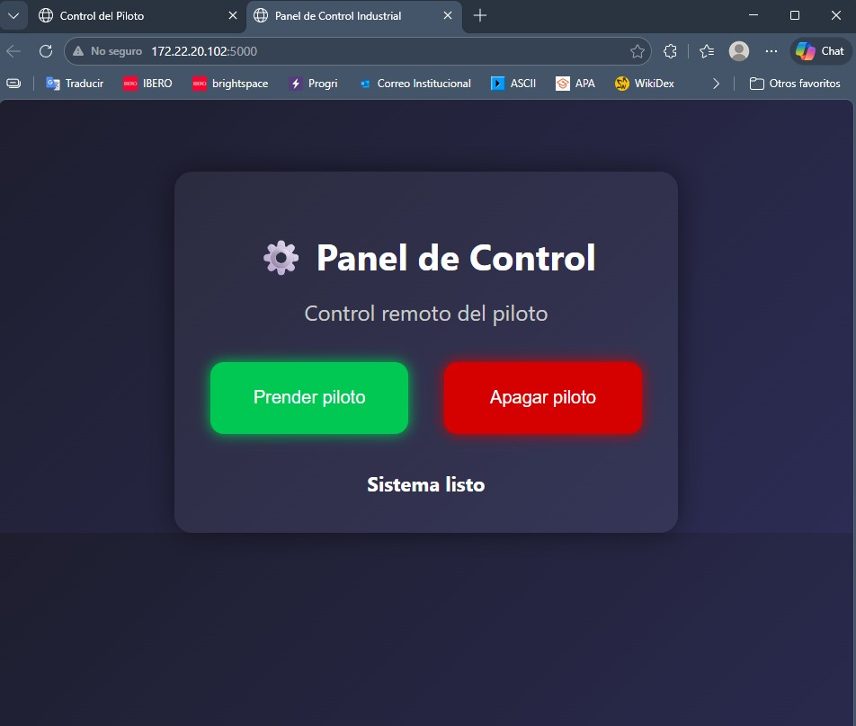

# Control de un PLC mediante Python y Flask

## Introducción

En esta práctica se desarrolló una interfaz web usando **Flask** en Python para controlar de forma remota un PLC a través del protocolo **Modbus TCP**.  
La idea principal fue crear una página accesible desde el navegador, con botones para **encender** y **apagar** un piloto conectado al PLC.

La comunicación se realizó usando la librería `pymodbus`, enviando valores a un registro del PLC previamente configurado dentro de **Connected Components Workbench**. De esta manera, Python actúa como intermediario entre la interfaz web y el controlador industrial.

---

## Objetivo

Implementar una aplicación web en Python con Flask que permita enviar comandos a un PLC mediante Modbus TCP, para controlar remotamente el encendido y apagado de un piloto.

---

## Código en Python

El programa fue desarrollado en Python utilizando Flask para la interfaz web y `pymodbus` para la comunicación con el PLC.  
En este caso, la aplicación se conecta al PLC con la dirección IP `192.168.3.154`, utilizando el puerto `502`, que corresponde a Modbus TCP. El sistema escribe valores enteros en el registro configurado, de forma que:

- `1` enciende el piloto
- `0` apaga el piloto

Además, la aplicación genera una interfaz web con dos botones, uno para encender y otro para apagar, mostrando también un mensaje de estado al usuario.

Puedes descargar el código aquí: :contentReference[oaicite:0]{index=0}

---

## Procedimiento

### 1. Configuración de la conexión Ethernet del PLC

Primero se configuró la comunicación Ethernet del PLC dentro de **Connected Components Workbench**.  
Se asignó manualmente la dirección IP `192.168.3.154`, la cual sería utilizada posteriormente desde Python para establecer la conexión Modbus TCP con el controlador.

---

### 2. Mapeo de la variable Modbus

Después se definió la variable que se utilizaría para la comunicación entre Python y el PLC.  
La variable utilizada fue `marrano`, asociada al registro **400001**. Este registro sería el punto de intercambio de datos para indicar si el piloto debía encenderse o apagarse.

Aunque en el programa Python se usa `REGISTER_ADDRESS = 0`, esto corresponde al primer holding register del mapeo Modbus, es decir, al registro 400001 configurado en el PLC.

---

### 3. Programación en Ladder dentro del PLC

Una vez configurado el registro, se cargó al PLC un programa en lenguaje Ladder.  
En este programa se compara el valor recibido en la variable `marrano`. Cuando dicha variable toma el valor de `1`, la salida del piloto se activa; en caso contrario, permanece apagada.

Con esto, el PLC queda listo para reaccionar a las instrucciones enviadas desde la aplicación desarrollada en Python.

---

### 4. Desarrollo y ejecución de la interfaz Flask

Finalmente, se ejecutó la aplicación Flask en la computadora, creando una interfaz web accesible desde el navegador en la dirección:

`http://172.22.20.102:5000`

Desde esta página se muestran dos botones: **Prender piloto** y **Apagar piloto**.  
Cada botón envía una solicitud al servidor Flask, el cual escribe el valor correspondiente en el PLC mediante Modbus TCP.

De esta forma, la interfaz web funciona como panel de control remoto para el piloto conectado al controlador industrial.

---

## Explicación general del funcionamiento

El sistema completo trabaja de la siguiente manera:

1. El usuario abre la página web generada con Flask.
2. Al presionar uno de los botones, Flask ejecuta una función en Python.
3. Python se conecta al PLC mediante Modbus TCP.
4. Se escribe un valor en el registro correspondiente.
5. El PLC lee ese valor en la variable `marrano`.
6. El programa Ladder decide si activa o desactiva la salida del piloto.

Esto permite realizar un control industrial básico desde una interfaz web simple, integrando software y hardware dentro de una misma práctica.

---

## Resultado

Se logró establecer una comunicación funcional entre Python y el PLC mediante Modbus TCP.  
La interfaz desarrollada en Flask permitió controlar remotamente el piloto desde un navegador web, enviando correctamente las señales de encendido y apagado al controlador.

Esta práctica demuestra cómo una aplicación web puede utilizarse como puente para supervisión y control de dispositivos industriales, integrando herramientas de software modernas con automatización industrial.

---

## Conclusión

La práctica permitió comprender cómo enlazar un entorno de programación como Python con un PLC industrial usando el protocolo Modbus TCP.  
Además, se observó que Flask puede utilizarse para construir interfaces de control sencillas, accesibles desde red local, lo cual resulta útil en aplicaciones de monitoreo y automatización.

En conjunto, esta implementación muestra una forma práctica de integrar tecnologías web con sistemas de control industrial, facilitando la interacción entre el usuario y el proceso físico.

---

## Inicio

[Inicio](index.md)