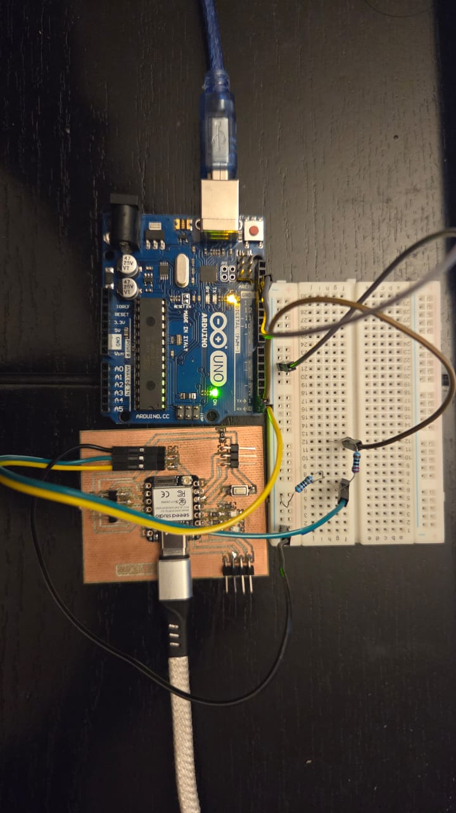
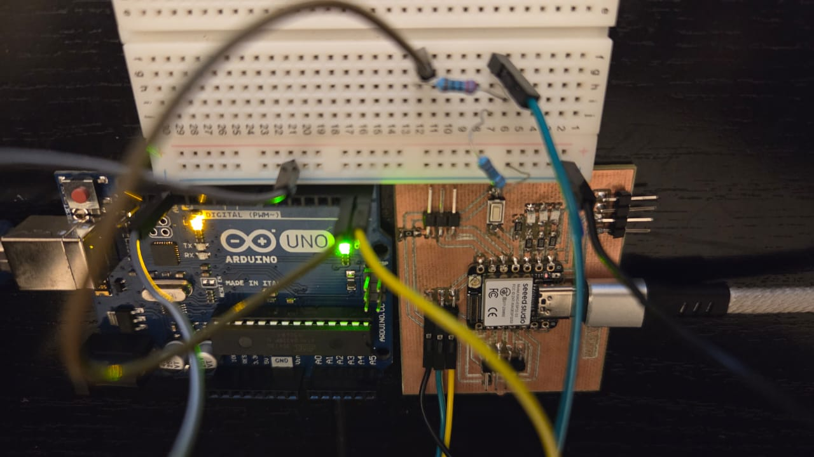
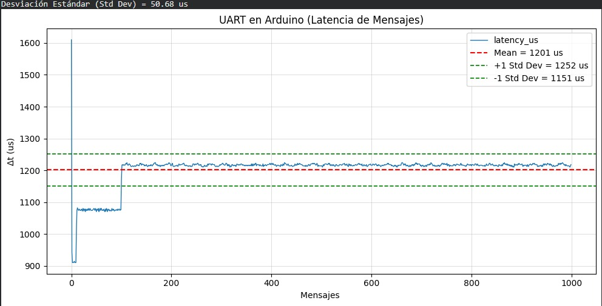
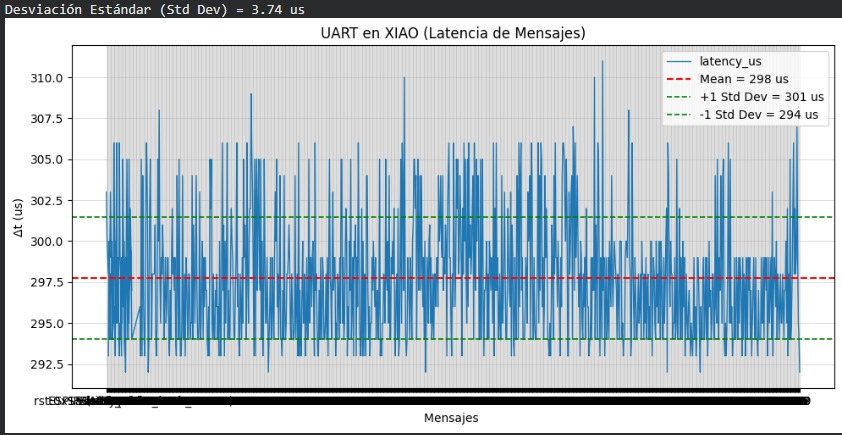
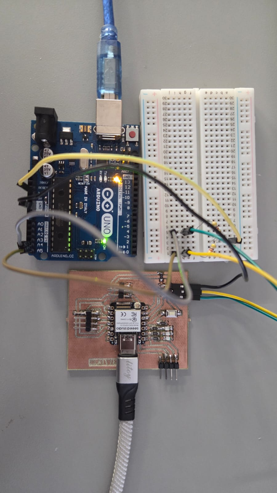
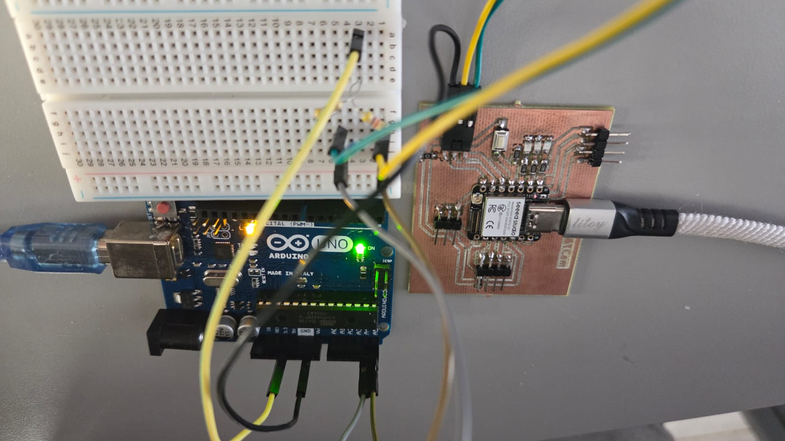
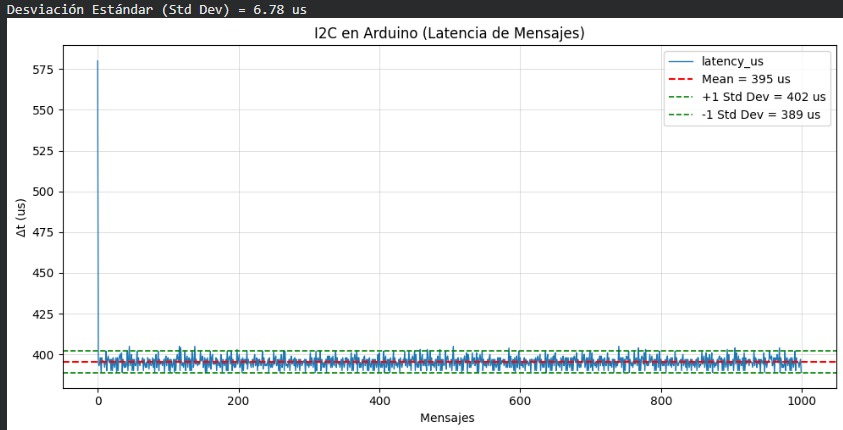
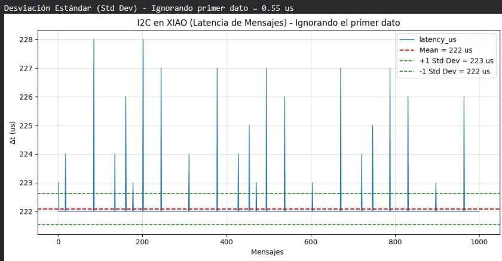
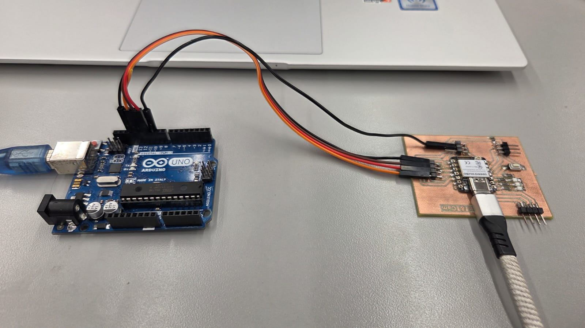
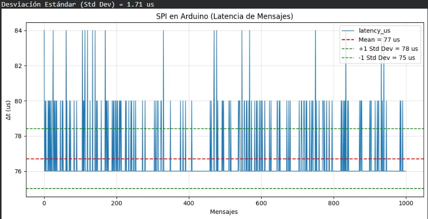

# Práctica 2

En la presente práctica se realizó la evaluación de distintos protocolos de comunicación entre plataformas de sistemas embebidos, con el objetivo de analizar su desempeño en términos de velocidad y latencia. Se implementaron pruebas de comunicación enviando 1000 mensajes entre dispositivos en este caso entre ATMEGA328p(Arduino UNO) y el XIAO-ESP32-S3 para posteriormente registrar y analizar el tiempo de respuesta de cada protocolo en cada dispositivo.

Los protocolos evaluados fueron:

- **UART**  
- **I2C**  
- **SPI**  

Para cada protocolo se documentan las **conexiones físicas**, los **códigos** cargados en cada microcontrolador y los resultados obtenidos mediante **gráficas de latencia**.

---

# UART

   - **Conexión**

    Se realizó la conexión física entre el Arduino UNO y el dispositivo receptor utilizando comunicación UART.  
    Se compartió una referencia común de tierra (GND) y se conectaron los pines TX y RX correspondientes.
    Para este caso se ocupó un divisor de voltaje con una resistencia de 1kΩ y 460Ω para eviatr 5v en la XIAO,
    gracias al divisor se obtuvo un voltaje seguro de ~3.4v

  

  

    ## UART Arduino UNO

      -**Medir latencia de comunicacion UART desde Arduino UNO

     **Código (Arduino UNO )**
      // ============================================================
//  Proyecto:   Medición de latencia UART
//  Plataforma: Arduino UNO (ATmega328P)
//  Rol:        MASTER (UART hardware: D0=RX, D1=TX)
//  Formato:    Salida CSV por Serial
// ============================================================

// ---------------------------
// Configuración general
// ---------------------------
#define BAUD_RATE 115200     // Baudrate del puerto Serial
#define N_MSG     1000       // Número de mensajes a enviar

// ---------------------------
// Variables globales
// ---------------------------
String rxLine = "";          // Buffer para acumular la línea recibida (hasta '\n')

// ---------------------------
// setup()
// ---------------------------
void setup() {
  // Inicializa UART hardware del UNO (pines D0/D1)
  Serial.begin(BAUD_RATE);
  delay(300); // Pequeña espera para estabilizar comunicación

  // Encabezado CSV (se imprime una sola vez)
  Serial.println("idx,rtt_us,latency_us");
}

// ---------------------------
// loop()
// ---------------------------
void loop() {
  // Control para ejecutar la prueba una sola vez
  static bool done = false;
  if (done) return;

  // Enviar N_MSG mensajes tipo PING y esperar su ACK correspondiente
  for (int i = 0; i < N_MSG; i++) {

    // Marca de tiempo antes de enviar el PING (microsegundos)
    unsigned long t0 = micros();

    // ---------------------------
    // 1) Enviar PING: "P,<idx>\n"
    // ---------------------------
    Serial.print("P,");
    Serial.print(i);
    Serial.print("\n");

    // ---------------------------
    // 2) Esperar ACK: "A,<idx>\n"
    //    - Se lee carácter por carácter hasta '\n'
    //    - Se valida que el id recibido coincida con i
    // ---------------------------
    rxLine = "";

    while (true) {
      if (Serial.available()) {
        char c = Serial.read();

        // Fin de línea: ya hay una trama completa para evaluar
        if (c == '\n') {

          // Validar prefijo "A," y que el id coincida con el enviado
          if (rxLine.startsWith("A,")) {
            int id = rxLine.substring(2).toInt();

            if (id == i) {
              // ---------------------------
              // 3) Calcular tiempos
              //    RTT  = t1 - t0
              //    Lat  = RTT / 2
              // ---------------------------
              unsigned long t1  = micros();
              unsigned long rtt = t1 - t0;
              unsigned long lat = rtt / 2;

              // ---------------------------
              // 4) Imprimir resultado en CSV
              // ---------------------------
              Serial.print(i);
              Serial.print(",");
              Serial.print(rtt);
              Serial.print(",");
              Serial.println(lat);

              break; // Sale del while (ACK correcto recibido)
            }
          }

          // Si no fue un ACK válido, reiniciar buffer y seguir esperando
          rxLine = "";

        } else {
          // Acumular caracteres (protección básica para no crecer sin control)
          if (rxLine.length() < 40) {
            rxLine += c;
          }
        }
      }
    }
  }

  // Marcar como finalizado para no repetir la prueba
  done = true;
}

     **Código (XIAO ESP32-S3 )**

     // ============================================================
//  Proyecto:   Medición de latencia UART 
//  Plataforma: Seeed XIAO ESP32-S3
//  Rol:        SLAVE (UART hardware: D7=RX, D6=TX)
//  Objetivo:   - Escuchar por UART (Serial1) tramas del UNO
//              - Responder a "P,<idx>" con "A,<idx>"
// ============================================================

// ---------------------------
// Configuración UART (Serial1)
// ---------------------------
#define UART_RX_PIN D7
#define UART_TX_PIN D6
#define BAUD_RATE   115200

// ---------------------------
// Variables globales
// ---------------------------
String buf = "";   // Buffer de línea recibida por Serial1 (hasta '\n')

// ---------------------------
// Utilidades de validación
// ---------------------------

// Verifica si un carácter es dígito (0-9)
bool isDigit(char c) {
  return (c >= '0' && c <= '9');
}

// Valida exactamente el patrón: digits,digits,digits
// - Debe contener solo dígitos y 2 comas
// - Debe iniciar con un dígito
// - Ejemplo válido: "12,3456,1728"
bool isCsvRow3(const String &s) {
  if (s.length() < 5) return false;  // mínimo "0,0,0"
  if (!isDigit(s[0])) return false;  // debe iniciar con número

  int commas = 0;

  for (int i = 0; i < (int)s.length(); i++) {
    char c = s[i];

    if (c == ',') {
      commas++;
    } else if (!isDigit(c)) {
      return false; // solo se aceptan dígitos o comas
    }
  }

  return (commas == 2);
}

// ---------------------------
// setup()
// ---------------------------
void setup() {
  // Serial por USB: aquí se imprime el CSV limpio para copiar/guardar
  Serial.begin(115200);
  delay(200);

  // UART hacia/desde el Arduino UNO
  Serial1.begin(BAUD_RATE, SERIAL_8N1, UART_RX_PIN, UART_TX_PIN);

  // Mensaje de estado (no es CSV; sirve para confirmar que el sketch corrió)
  Serial.println("XIAO: listo (CSV limpio)");
}

// ---------------------------
// loop()
// ---------------------------
void loop() {
  // Leer todo lo disponible en UART (Serial1)
  while (Serial1.available()) {
    char c = Serial1.read();

    // ---------------------------
    // Fin de línea: procesar trama completa
    // ---------------------------
    if (c == '\n') {

      // Si llegó como "\r\n", eliminar el '\r'
      if (buf.length() > 0 && buf[buf.length() - 1] == '\r') {
        buf.remove(buf.length() - 1);
      }

      // ---------------------------
      // 1) Protocolo PING/ACK
      //    - Recibe:  "P,<id>"
      //    - Responde: "A,<id>\n"
      // ---------------------------
      if (buf.startsWith("P,")) {
        int id = buf.substring(2).toInt();

        Serial1.print("A,");
        Serial1.print(id);
        Serial1.print("\n");
      }

      // ---------------------------
      // 2) Bridge: imprimir SOLO CSV limpio por USB
      //    - Header: "idx,rtt_us,latency_us"
      //    - Filas:  "digits,digits,digits"
      // ---------------------------
      if (buf == "idx,rtt_us,latency_us" || isCsvRow3(buf)) {
        Serial.println(buf);
      }

      // Reiniciar buffer para la siguiente línea
      buf = "";

    } else {
      // ---------------------------
      // Acumular caracteres hasta completar la línea
      // - Protección por tamaño para evitar overflow del buffer
      // ---------------------------
      if (buf.length() < 140) {
        buf += c;
      } else {
        // Si se desborda, descartar la línea actual
        buf = "";
      }
    }
  }
}

   ### Resultados
      A continuación se presentará la gráfica de resultado sobre el tiempo de respuesta y latencia del protocolo de comunicación UART en Arduino UNO

  

      En la gráfica se observa que al inicio la latencia de los mensajes UART es menor, pero cambia hasta llegar a un valor  estable cercano a 1200 µs. Este comportamiento ocurre porque, en los primeros mensajes, el sistema acaba de arrancar y los buffers de comunicación todavía están vacíos, por lo que los mensajes se procesan más rápido.

      Conforme se envían más mensajes, la comunicación UART entra en un funcionamiento continuo ,entonces, los buffers se llenan, el microcontrolador empieza a esperar respuestas de forma repetitiva y el tiempo de transmisión se vuelve constante. Esto provoca que la latencia aumente ligeramente y luego se mantenga casi igual para el resto de los mensajes.
     

   ## UART XIAO ESP32-S3

     -**Medir latencia de comunicacion UART desde XIAO ESP32-S3
      
     - **Código (Arduino UNO )**

// ============================================================
//  Proyecto:   Medición de latencia UART
//  Plataforma: Arduino UNO (ATmega328P)
//  Rol:        SLAVE / (UART hardware: D7=RX, D6=TX)
//  Objetivo:   Recibe 1 byte y lo regresa inmediatamente (eco)
// ============================================================

// ---------------------------
// Configuración general
// ---------------------------
const uint32_t BAUD = 115200;   // Baudrate UART (debe coincidir con el XIAO)

// ---------------------------
// setup()
// ---------------------------
void setup() {
  // Inicializa UART hardware del UNO
  Serial.begin(BAUD);
}

// ---------------------------
// loop()
// ---------------------------
void loop() {
  // Si hay al menos un byte disponible, leerlo y devolverlo
  if (Serial.available()) {
    int b = Serial.read();            // Lee 1 byte (retorna -1 si falla)
    if (b >= 0) {
      Serial.write((uint8_t)b);       // Eco inmediato del byte recibido
    }
  }
}

     - **Código (XIAO ESP32-S3 )**

// ============================================================
//  Proyecto:   Medición UART en XIAO 
//  Plataforma: Seeed XIAO ESP32-S3
//  Rol:        MASTER (UART hardware: D7=RX, D6=TX)
//  Objetivo:   USB Serial (CSV): idx,rtt_us,latency_us
// ============================================================

#include <Arduino.h>

// ---------------------------
// Configuración general
// ---------------------------
const uint32_t BAUD = 115200;          // Baudrate UART (debe coincidir con el UNO)

// Pines UART en XIAO ESP32-S3 (Serial1)
const int TX_PIN = D6;
const int RX_PIN = D7;

// Parámetros de medición
const uint16_t N_SAMPLES  = 2000;      // Número de muestras (ej. 1000 o 2000)
const uint32_t TIMEOUT_US = 30000;     // Timeout de espera del eco (microsegundos)

// ---------------------------
// Función auxiliar: leer 1 byte con timeout
// ---------------------------
// Devuelve true si se recibió un byte antes del timeout.
// Devuelve false si se agotó el tiempo sin recibir nada.
static inline bool read_one_byte(uint8_t &out, uint32_t timeout_us) {
  uint32_t start = micros();

  while ((uint32_t)(micros() - start) < timeout_us) {
    if (Serial1.available() > 0) {
      int b = Serial1.read();
      if (b >= 0) {
        out = (uint8_t)b;
        return true;
      }
    }
    // Sin delays: lectura lo más rápida posible
  }

  return false;
}

// ---------------------------
// setup()
// ---------------------------
void setup() {
  // USB Serial: salida CSV para copiar/guardar
  Serial.begin(115200);
  while (!Serial) { delay(10); }

  // UART hacia el Arduino UNO
  Serial1.begin(BAUD, SERIAL_8N1, RX_PIN, TX_PIN);

  // Encabezado CSV
  Serial.println("idx,rtt_us,latency_us");
}

// ---------------------------
// loop()
// ---------------------------
void loop() {
  // Recolectar N_SAMPLES mediciones
  for (uint32_t i = 0; i < N_SAMPLES; i++) {

    // ---------------------------
    // 1) Limpiar bytes previos en el buffer UART
    // ---------------------------
    while (Serial1.available()) {
      (void)Serial1.read();
    }

    // Byte a enviar (se usa el índice para variar el dato)
    uint8_t tx = (uint8_t)(i & 0xFF);

    // ---------------------------
    // 2) Enviar 1 byte y medir RTT
    // ---------------------------
    uint32_t t0 = micros();
    Serial1.write(tx);  // No usar flush: buscamos máxima velocidad

    // ---------------------------
    // 3) Esperar eco (1 byte) con timeout
    // ---------------------------
    uint8_t rx = 0;
    bool ok = read_one_byte(rx, TIMEOUT_US);
    uint32_t t1 = micros();

    // ---------------------------
    // 4) Validación y salida CSV
    // ---------------------------
    if (!ok || rx != tx) {
      // Si falló o el byte no coincide, marcar como NaN
      Serial.print(i);
      Serial.println(",nan,nan");
      continue;
    }

    uint32_t rtt     = t1 - t0;
    uint32_t latency = rtt / 2;

    Serial.print(i);
    Serial.print(",");
    Serial.print(rtt);
    Serial.print(",");
    Serial.println(latency);
  }

  // Termina la prueba (evita repetir y mezclar datos)
  while (true) {
    delay(1000);
  }
}

   ### Resultados
      A continuación se presentará la gráfica de resultado sobre el tiempo de respuesta y latencia del protocolo de comunicación UART en XIAO ESP32-S3

  

    En esta práctica se evaluó el protocolo UART en la XIAO ESP32-S3 mediante comunicación ping-pong. Los resultados muestran una latencia promedio de ~149 µs y una baja variación (1.89 µs), lo que indica una comunicación rápida y estable.

    La mayoría de las mediciones se concentran en un rango estrecho, confirmando la confiabilidad del sistema. En comparación con el Arduino UNO, la XIAO ESP32-S3 presenta un mejor desempeño, por lo que UART en esta plataforma es adecuado para aplicaciones embebidas que requieren baja latencia.

# I2C

   - **Conexión**

    Para el armado se hizo una conexión de pull up a 3.3v para evitar daños en el xiao
    Con 2 resistencias de 470ohms

   

   

    ## I2C Arduino UNO

      -**Medir latencia de comunicacion I2C desde Arduino UNO

      - **Código (Arduino UNO )**

// ============================================================
//  Proyecto:   Medición de latencia I2C
//  Plataforma: Arduino UNO (ATmega328P)
//  Rol:        SLAVE (I2C)
//  Dirección:  0x08
//  Respuesta:  [echo_token][latency_u32_LE]
// ============================================================

#include <Wire.h>

#define SLAVE_ADDR 0x08

volatile uint8_t  last_token = 0;
volatile uint32_t t_rx = 0;

// Recibe 1 byte (token) del master
void onReceive(int n) {
  while (Wire.available()) {
    last_token = Wire.read();
  }
  t_rx = micros();
}

// Cuando el master pide datos, responde token + latencia
void onRequest() {
  uint32_t latency = micros() - t_rx;

  Wire.write(last_token);
  Wire.write((uint8_t)(latency & 0xFF));
  Wire.write((uint8_t)((latency >> 8) & 0xFF));
  Wire.write((uint8_t)((latency >> 16) & 0xFF));
  Wire.write((uint8_t)((latency >> 24) & 0xFF));
}

void setup() {
  Wire.begin(SLAVE_ADDR);
  Wire.onReceive(onReceive);
  Wire.onRequest(onRequest);

  // Pull-ups internos OFF (bus con pull-ups externos a 3.3V)
  PORTC &= ~((1 << PC4) | (1 << PC5));  // A4/A5 sin pull-up
  pinMode(A4, INPUT);
  pinMode(A5, INPUT);
  digitalWrite(A4, LOW);
  digitalWrite(A5, LOW);
}

void loop() {}

     - **Código (XIAO ESP32-S3 )**

      // ============================================================
//  Proyecto:   Medición de latencia I2C
//  Plataforma: Seeed XIAO ESP32-S3
//  Rol:        MASTER (I2C)
//  Dirección:  0x08
//  CSV:        idx,rtt_us,echo_ok,arduino_latency_us
// ============================================================

#include <Wire.h>

#define SLAVE_ADDR 0x08

const int SDA_PIN = 5;  // D4/SDA = GPIO5
const int SCL_PIN = 6;  // D5/SCL = GPIO6

const uint32_t I2C_HZ  = 100000;  // 100000 o 400000
const uint32_t N       = 2000;
const uint32_t PAUSE_US = 200;

uint32_t readU32LE() {
  uint32_t v = 0;
  v |= (uint32_t)Wire.read();
  v |= (uint32_t)Wire.read() << 8;
  v |= (uint32_t)Wire.read() << 16;
  v |= (uint32_t)Wire.read() << 24;
  return v;
}

void setup() {
  Serial.begin(115200);
  while (!Serial) {}

  Wire.begin(SDA_PIN, SCL_PIN);
  Wire.setClock(I2C_HZ);

  Serial.println("idx,rtt_us,echo_ok,arduino_latency_us");
}

void loop() {
  static uint32_t idx = 0;
  if (idx >= N) while (1) {}

  uint8_t token = (uint8_t)(idx & 0xFF);

  uint32_t t0 = micros();

  // WRITE 1 byte
  Wire.beginTransmission(SLAVE_ADDR);
  Wire.write(token);
  uint8_t err = Wire.endTransmission();

  if (err != 0) {
    uint32_t rtt = micros() - t0;
    Serial.printf("%lu,%lu,%d,%d\n", idx, rtt, 0, -1);
    idx++;
    delayMicroseconds(PAUSE_US);
    return;
  }

  // READ 5 bytes: echo + latency_u32
  uint8_t got = Wire.requestFrom(SLAVE_ADDR, (uint8_t)5);

  uint8_t  echo = 0xFF;
  uint32_t latency = 0xFFFFFFFF;

  if (got == 5) {
    echo = Wire.read();
    latency = readU32LE();
  }

  uint32_t rtt = micros() - t0;
  uint8_t ok = (echo == token) ? 1 : 0;

  Serial.printf("%lu,%lu,%d,%ld\n",
                idx, rtt, ok,
                (latency == 0xFFFFFFFF) ? -1L : (long)latency);

  idx++;
  delayMicroseconds(PAUSE_US);
}

     ### Resultados
      A continuación se presentará la gráfica de resultado sobre el tiempo de respuesta y latencia del protocolo de comunicación I2C en XIAO ESP32-S3

  

    En la gráfica se observa que al inicio la latencia de los mensajes UART es menor, pero cambia hasta llegar a un valor  estable cercano a 1200 µs. Este comportamiento ocurre porque, en los primeros mensajes, el sistema acaba de arrancar y los buffers de comunicación todavía están vacíos, por lo que los mensajes se procesan más rápido.

  Conforme se envían más mensajes, la comunicación UART entra en un funcionamiento continuo ,entonces, los buffers se llenan, el microcontrolador empieza a esperar respuestas de forma repetitiva y el tiempo de transmisión se vuelve constante. Esto provoca que la latencia aumente ligeramente y luego se mantenga casi igual para el resto de los mensajes.
 
   ## I2C XIAO ESP32-S3

     -**Medir latencia de comunicacion I2C desde XIAO ESP32-S3
      
     - **Código (Arduino UNO )**

 // ============================================================
//  Proyecto:   Medición I2C (eco simple)
//  Plataforma: Arduino UNO (ATmega328P)
//  Rol:        SLAVE (I2C)
//  Dirección:  0x08
//  Respuesta:  1 byte (eco)
// ============================================================

#include <Wire.h>

#define SLAVE_ADDR 0x08

volatile uint8_t lastByte = 0;

void receiveEvent(int howMany) {
  if (Wire.available()) {
    lastByte = Wire.read();
  }
}

void requestEvent() {
  Wire.write(lastByte); // eco
}

void setup() {
  Wire.begin(SLAVE_ADDR);
  Wire.onReceive(receiveEvent);
  Wire.onRequest(requestEvent);
}

void loop() {
}

   - **Código (XIAO ESP32-S3 )**

// ============================================================
//  Proyecto:   Medición I2C (RTT) desde XIAO
//  Plataforma: Seeed XIAO ESP32-S3
//  Rol:        MASTER (I2C)
//  Dirección:  0x08
//  CSV:        idx,rtt_us
// ============================================================

#include <Wire.h>

#define SLAVE_ADDR 0x08
#define MAX_MSGS 1000

uint32_t idx = 0;

void setup() {
  Serial.begin(115200);

  Wire.begin();          // XIAO como master
  Wire.setClock(400000); // 400 kHz

  Serial.println("idx,rtt_us");
}

void loop() {

  if (idx >= MAX_MSGS) {
    while (1) {
      delay(1000);
    }
  }

  uint32_t t0 = micros();

  // Enviar dato
  Wire.beginTransmission(SLAVE_ADDR);
  Wire.write((uint8_t)(idx & 0xFF));
  Wire.endTransmission();

  // Pedir eco
  Wire.requestFrom(SLAVE_ADDR, 1);
  if (Wire.available()) {
    Wire.read();
  }

  uint32_t t1 = micros();
  uint32_t rtt = t1 - t0;

  Serial.print(idx);
  Serial.print(",");
  Serial.println(rtt);

  idx++;

  delay(5); // quítalo si quieres saturar el bus
}

  ### Resultados
  A continuación se presentará la gráfica de resultado sobre el tiempo de respuesta y latencia del protocolo de comunicación UART en XIAO ESP32-S3

  

  En esta práctica se evaluó el protocolo UART en la XIAO ESP32-S3 mediante comunicación ping-pong. Los resultados muestran una latencia promedio de ~149 µs y una baja variación (1.89 µs), lo que indica una comunicación rápida y estable.

  La mayoría de las mediciones se concentran en un rango estrecho, confirmando la confiabilidad del sistema. En comparación con el Arduino UNO, la XIAO ESP32-S3 presenta un mejor desempeño, por lo que UART en esta plataforma es adecuado para aplicaciones embebidas que requieren baja latencia.

# SPI

   - **Conexión**

    Para el armado se hizo una conexión de pull up a 3.3v para evitar daños en el xiao
    Con 2 resistencias de 470ohms

   

   

    ## I2C Arduino UNO

      -**Medir latencia de comunicacion SPI desde Arduino UNO

      - **Código (Arduino UNO )**

// ============================================================
//  Proyecto:   Medición de latencia I2C
//  Plataforma: Arduino UNO (ATmega328P)
//  Rol:        SLAVE (I2C)
//  Dirección:  0x08
//  Respuesta:  [echo_token][latency_u32_LE]
// ============================================================

#include <Wire.h>

#define SLAVE_ADDR 0x08

volatile uint8_t  last_token = 0;
volatile uint32_t t_rx = 0;

// Recibe 1 byte (token) del master
void onReceive(int n) {
  while (Wire.available()) {
    last_token = Wire.read();
  }
  t_rx = micros();
}

// Cuando el master pide datos, responde token + latencia
void onRequest() {
  uint32_t latency = micros() - t_rx;

  Wire.write(last_token);
  Wire.write((uint8_t)(latency & 0xFF));
  Wire.write((uint8_t)((latency >> 8) & 0xFF));
  Wire.write((uint8_t)((latency >> 16) & 0xFF));
  Wire.write((uint8_t)((latency >> 24) & 0xFF));
}

void setup() {
  Wire.begin(SLAVE_ADDR);
  Wire.onReceive(onReceive);
  Wire.onRequest(onRequest);

  // Pull-ups internos OFF (bus con pull-ups externos a 3.3V)
  PORTC &= ~((1 << PC4) | (1 << PC5));  // A4/A5 sin pull-up
  pinMode(A4, INPUT);
  pinMode(A5, INPUT);
  digitalWrite(A4, LOW);
  digitalWrite(A5, LOW);
}

void loop() {}

     - **Código (XIAO ESP32-S3 )**

      // ============================================================
//  Proyecto:   Medición de latencia I2C
//  Plataforma: Seeed XIAO ESP32-S3
//  Rol:        MASTER (I2C)
//  Dirección:  0x08
//  CSV:        idx,rtt_us,echo_ok,arduino_latency_us
// ============================================================

#include <Wire.h>

#define SLAVE_ADDR 0x08

const int SDA_PIN = 5;  // D4/SDA = GPIO5
const int SCL_PIN = 6;  // D5/SCL = GPIO6

const uint32_t I2C_HZ  = 100000;  // 100000 o 400000
const uint32_t N       = 2000;
const uint32_t PAUSE_US = 200;

uint32_t readU32LE() {
  uint32_t v = 0;
  v |= (uint32_t)Wire.read();
  v |= (uint32_t)Wire.read() << 8;
  v |= (uint32_t)Wire.read() << 16;
  v |= (uint32_t)Wire.read() << 24;
  return v;
}

void setup() {
  Serial.begin(115200);
  while (!Serial) {}

  Wire.begin(SDA_PIN, SCL_PIN);
  Wire.setClock(I2C_HZ);

  Serial.println("idx,rtt_us,echo_ok,arduino_latency_us");
}

void loop() {
  static uint32_t idx = 0;
  if (idx >= N) while (1) {}

  uint8_t token = (uint8_t)(idx & 0xFF);

  uint32_t t0 = micros();

  // WRITE 1 byte
  Wire.beginTransmission(SLAVE_ADDR);
  Wire.write(token);
  uint8_t err = Wire.endTransmission();

  if (err != 0) {
    uint32_t rtt = micros() - t0;
    Serial.printf("%lu,%lu,%d,%d\n", idx, rtt, 0, -1);
    idx++;
    delayMicroseconds(PAUSE_US);
    return;
  }

  // READ 5 bytes: echo + latency_u32
  uint8_t got = Wire.requestFrom(SLAVE_ADDR, (uint8_t)5);

  uint8_t  echo = 0xFF;
  uint32_t latency = 0xFFFFFFFF;

  if (got == 5) {
    echo = Wire.read();
    latency = readU32LE();
  }

  uint32_t rtt = micros() - t0;
  uint8_t ok = (echo == token) ? 1 : 0;

  Serial.printf("%lu,%lu,%d,%ld\n",
                idx, rtt, ok,
                (latency == 0xFFFFFFFF) ? -1L : (long)latency);

  idx++;
  delayMicroseconds(PAUSE_US);
}

     ### Resultados
      A continuación se presentará la gráfica de resultado sobre el tiempo de respuesta y latencia del protocolo de comunicación I2C en XIAO ESP32-S3

  

    En la gráfica se observa que al inicio la latencia de los mensajes UART es menor, pero cambia hasta llegar a un valor  estable cercano a 1200 µs. Este comportamiento ocurre porque, en los primeros mensajes, el sistema acaba de arrancar y los buffers de comunicación todavía están vacíos, por lo que los mensajes se procesan más rápido.

  Conforme se envían más mensajes, la comunicación UART entra en un funcionamiento continuo ,entonces, los buffers se llenan, el microcontrolador empieza a esperar respuestas de forma repetitiva y el tiempo de transmisión se vuelve constante. Esto provoca que la latencia aumente ligeramente y luego se mantenga casi igual para el resto de los mensajes.
 
   ## I2C XIAO ESP32-S3

     -**Medir latencia de comunicacion I2C desde XIAO ESP32-S3
      
     - **Código (Arduino UNO )**

 // ============================================================
//  Proyecto:   Medición I2C (eco simple)
//  Plataforma: Arduino UNO (ATmega328P)
//  Rol:        SLAVE (I2C)
//  Dirección:  0x08
//  Respuesta:  1 byte (eco)
// ============================================================

#include <Wire.h>

#define SLAVE_ADDR 0x08

volatile uint8_t lastByte = 0;

void receiveEvent(int howMany) {
  if (Wire.available()) {
    lastByte = Wire.read();
  }
}

void requestEvent() {
  Wire.write(lastByte); // eco
}

void setup() {
  Wire.begin(SLAVE_ADDR);
  Wire.onReceive(receiveEvent);
  Wire.onRequest(requestEvent);
}

void loop() {
}

   - **Código (XIAO ESP32-S3 )**

// ============================================================
//  Proyecto:   Medición I2C (RTT) desde XIAO
//  Plataforma: Seeed XIAO ESP32-S3
//  Rol:        MASTER (I2C)
//  Dirección:  0x08
//  CSV:        idx,rtt_us
// ============================================================

#include <Wire.h>

#define SLAVE_ADDR 0x08
#define MAX_MSGS 1000

uint32_t idx = 0;

void setup() {
  Serial.begin(115200);

  Wire.begin();          // XIAO como master
  Wire.setClock(400000); // 400 kHz

  Serial.println("idx,rtt_us");
}

void loop() {

  if (idx >= MAX_MSGS) {
    while (1) {
      delay(1000);
    }
  }

  uint32_t t0 = micros();

  // Enviar dato
  Wire.beginTransmission(SLAVE_ADDR);
  Wire.write((uint8_t)(idx & 0xFF));
  Wire.endTransmission();

  // Pedir eco
  Wire.requestFrom(SLAVE_ADDR, 1);
  if (Wire.available()) {
    Wire.read();
  }

  uint32_t t1 = micros();
  uint32_t rtt = t1 - t0;

  Serial.print(idx);
  Serial.print(",");
  Serial.println(rtt);

  idx++;

  delay(5); // quítalo si quieres saturar el bus
}

  ### Resultados
  A continuación se presentará la gráfica de resultado sobre el tiempo de respuesta y latencia del protocolo de comunicación UART en XIAO ESP32-S3

  

  En esta práctica se evaluó el protocolo UART en la XIAO ESP32-S3 mediante comunicación ping-pong. Los resultados muestran una latencia promedio de ~149 µs y una baja variación (1.89 µs), lo que indica una comunicación rápida y estable.

  La mayoría de las mediciones se concentran en un rango estrecho, confirmando la confiabilidad del sistema. En comparación con el Arduino UNO, la XIAO ESP32-S3 presenta un mejor desempeño, por lo que UART en esta plataforma es adecuado para aplicaciones embebidas que requieren baja latencia.

---

## Siguiente sección

[Calibración](calibracion.md)
